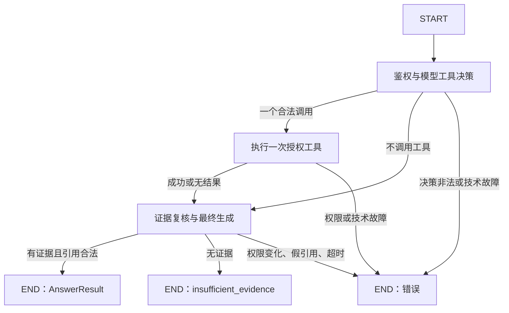

# 一次工具决策的 LangGraph（第 24A 步）

## 能力与范围

`app.agent.graph.run_once` 是可信后端使用的 Python 入口：模型决定是否调用 `search_knowledge` 或 `read_chunks`，并给出参数。后端校验后至多执行一次，再依据授权证据生成回答。没有自动循环、重试决策节点、HTTP 入口或持久图状态；现有固定 RAG 接口继续使用原流程。



图没有回到决策节点的边。搜索参数不是后端固定复制问题：fake 测试验证模型改写的 query 实际传入 Embedding。完成的是单次模型工具决策机制，未验证真实模型的自主检索质量，也没有多轮检索能力。

## 状态与可信边界

| 状态字段 | 含义 |
| --- | --- |
| original_question | 经校验的原问题，节点不改写；模型搜索 query 另存于 decision |
| evidence | 工具实际返回的受限片段，由后端写入，非模型生成 |
| tool_call_count | 本次图分发的工具调用数，0 或 1；权限拒绝的已分发调用也计数 |
| model_call_count | 本次图的模型方法调用次数，含决策、Embedding、最终 Chat；供应商网络重试次数另见 trace call_count |
| deadline | 后端 monotonic 时钟的绝对截止值，不能作为跨进程时间戳 |
| final_result | 复用 AnswerResult；错误时为 null |
| decision / tool_result / error | 已验证的决策、工具结果及安全错误响应 |

身份仍在第 23 步 frozen RunContext 中，通过 frozen AgentContext 作为 LangGraph runtime context 注入依赖，未放进模型参数。只读指身份与配置不能被模型 JSON 修改，不代表 Python 宿主代码运行于安全沙箱。

`run_once` 只接受问题和可信后端依赖，不接受模型提交的 state、evidence、deadline、身份或调用计数。一个 KnowledgeTools 实例只能进入图一次；后端不能反复调用入口构造隐式循环。

## 原生 tool calling 与后端校验

- `OpenAIToolDecisionClient` 复用现有 OpenAI HTTP 客户端、密钥、连接/读取超时及最多 3 次有限重试。
- 沿用 `gpt-4.1-mini-2025-04-14`，发送 Chat Completions 原生 function tools，设置 `tool_choice=auto`、`parallel_tool_calls=false`、函数 `strict=true`。这不是要求模型在自然语言中输出伪工具 JSON。
- 提供商 schema 的所有属性均为 required，因此模型须显式提供 top_k；直接 Python 工具仍保留默认 5。UUID 去重由后端执行，provider schema 不依赖 uniqueItems。
- 校验 choices/finish_reason/function 类型、单次调用数量、参数 JSON、重复 JSON 键、工具名、参数范围和额外字段；超过一个调用直接拒绝，不截取第一个。
- 验证在真实适配器及图边界执行，fake 决策也不能绕过。无调用时丢弃决策模型的自然语言，它不能直接成为企业资料答案。
- 非法工具调用返回 `MODEL_INVALID_TOOL_CALL` 技术错误；没有执行工具，不自动修复参数或重新请求模型。

冷启动的候选集合为空，模型选择 read 时会被拒绝。要验证读取成功分支，可信后端可以先在同一提问中调用一次 search，再把同一个工具实例交给图；图仅从工具内部取得快照，并在发送给模型前复核权限及来源。这项准备动作是显式预检索，不是图内自主产生的动作，图的调用计数不包含它；若共用同一个 trace，该预检索仍留在完整请求 trace 中。

## 最终回答与证据

提取既有 `answer_from_chunks`，固定 RAG 和图复用相同上下文构造、ANSWER_SCHEMA、引用 ID 校验及后端 Citation 拼装。

- 空证据直接返回 insufficient_evidence，不调用最终 Chat。
- 有片段但资料不足时允许模型输出 insufficient_evidence；要求澄清也沿用既有状态。
- answered 必须有本次上下文内的引用。编造或缺少引用不能作为成功答案返回。
- 生成前后复核当前成员资格、document/build/chunk 链、active ready 构建及原始全文哈希；删除或重建不偷偷映射新来源。
- 最终模型只看到工具实际输出的片段。引用 snippet 保持这段片段，不因为数据库保存全文而扩充引用；截断时设置 evidence_omitted，提醒不得推断省略条件。
- 问题和资料中的命令是数据，不接受其中的 shell/SQL/URL 或写入请求。fake 测试证明提示词与工具边界被保留，不证明真实模型能抵抗所有提示注入。

**引用 ID 合法只能证明来源有效，不能证明事实正确或结论被原文支持；仍需要独立人工评测。**

## deadline 与错误

默认 60 秒，后端可设 (0, 300] 秒。节点和模型调用边界检查 deadline；迟到的结果被丢弃，不再调用后续模型。技术故障保持 error 与 final_result=null，不能冒充资料不足。

同步实现不能强制中断已发出的 HTTP 调用；外部调用依靠底层连接/读取超时及有限重试完成，实际返回可能晚于 deadline。测试用可控时钟推进时间，不 sleep。`AGENT_DEADLINE_TIMEOUT` 标识预算到期；`MODEL_TIMEOUT` 标识适配器故障。失败时清除状态中的证据和已成功工具的正文，trace 不保留最终引用。

## trace 与隐私

沿用 RequestTrace，必须与工具的 user_id/kb_id/request_id 一致。事件包含合法工具名、参数摘要（query_chars/top_k 或 chunk_id_count）、结果数、结果状态、安全错误码和阶段耗时；模型用量沿用现有包装。未验证的工具名不直接写入事件名。

不要求、不保存模型私有思维链，不保存 query/参数正文、完整提示词和文档。图执行显式关闭 LangSmith tracing，不因环境中已有遥测配置导出完整 state；不使用 checkpointer。state 含正文，只供可信后端检查，不能完整写日志或直接作为公共响应。调用方应只返回 final_result 或 error。

工具和图不会自行持久化 trace。未来 HTTP 宿主应复用已有 trace 保存与授权查询服务；本步不新建监控平台。

## 后端使用示例

下面函数接收上游已经验证的用户 ID 和已确定的单个 kb_id；不能把这些身份依赖映射为模型可编辑参数。

```python
from uuid import uuid4

from app.agent.contracts import RunContext
from app.agent.tools import KnowledgeTools
from app.agent.graph import run_once
from app.services.traces import RequestTrace


def ask_once(question, verified_user_id, kb_id, session_factory,
             profile, embedding_factory, decision_factory, chat_factory):
    request_id = uuid4().hex
    trace = RequestTrace(request_id, kb_id)
    trace.user_id = verified_user_id
    tools = KnowledgeTools(
        RunContext(verified_user_id, kb_id, request_id),
        session_factory, profile, embedding_factory, trace=trace,
    )
    state = run_once(
        question, tools=tools, trace=trace,
        decision_factory=decision_factory, chat_factory=chat_factory,
    )
    error = state["error"]
    payload = trace.finish(error["status"] if error else 200,
                           error["code"] if error else None)
    # payload 可由宿主交给现有 persist 服务；不要保存完整 state。
    return state["final_result"], error, payload
```

离线使用 `FakeDecisionClient({"tool_calls": [{"id": "call_1", "name": "search_knowledge", "arguments": {"query": "报销", "top_k": 5}}]})` 与已有 FakeChatClient。真实决策工厂用 OpenAIToolDecisionClient，参数由现有 Settings 提供；密钥仅取环境，不自动回退 fake。真实和 fake 索引仍须隔离。

## 验收命令（PowerShell）

准备专用 PostgreSQL+pgvector 测试服务器；测试账号需能创建随机临时数据库。测试会清理这些库，不应指向生产数据库。未设置 URL 会跳过数据库测试，不能将跳过称为通过。

```powershell
cd backend
uv sync --locked
$env:TEST_POSTGRES_ADMIN_URL = Read-Host "专用测试服务器 URL（postgresql+psycopg://.../postgres）"
uv run --locked pytest -q tests/test_agent_graph.py tests/test_agent_tools.py tests/test_answers.py
uv run --locked ruff check .
uv run --locked ruff format --check .
uv lock --check
```

原生协议检查使用 httpx.MockTransport，不联网、不产生模型费用。真实接口未验证；实际测试结果与遗留问题记录在 [progress.md](progress.md)。

## 依赖与官方依据

锁定 LangGraph 1.2.12；沿用 Python >=3.12,<3.14。安装引入 langchain-core、langgraph 的 checkpoint/prebuilt/sdk、langsmith 等传递依赖，但本步不使用持久化、预构建 Agent 或远程服务。uv.lock 保存完整版本，现有 httpx 继续供模型客户端使用；新传递依赖 httpx2 也使 Starlette 不再触发此前 httpx 弃用警告。

- [LangGraph Graph API](https://docs.langchain.com/oss/python/langgraph/graph-api)：StateGraph、条件边、runtime context 和 END。
- [LangGraph Quickstart](https://docs.langchain.com/oss/python/langgraph/quickstart)：节点返回状态更新，compile 后执行；本步移除示例中的循环结构。
- [OpenAI Function calling](https://developers.openai.com/api/docs/guides/function-calling)：原生函数调用、strict schema 与关闭并行调用，仍须后端校验。
- [GPT-4.1 mini](https://developers.openai.com/api/docs/models/gpt-4.1-mini)：既有快照支持 function calling 和结构化输出；文档支持不等于本项目已真实调用验证。

## 解释与面试准备

知识点：有限状态机的安全约束可以由图拓扑表达。没有回边意味着本次决策不会因模型要求“继续搜索”而重复执行；schema 决定模型能提交什么，运行上下文决定它以谁的权限执行。

1. 与固定 RAG 的区别？固定 RAG 后端总是先检索；这里模型可以改写检索参数、选择读取已有候选或不调用。只有一次选择，不宣称多步规划能力。
2. 为什么原生 strict tool calling 后还要校验？模型输出、适配器和 fake 都可能不满足业务约束；schema 不能替代当前授权、候选登记、引用及构建有效性检查。
