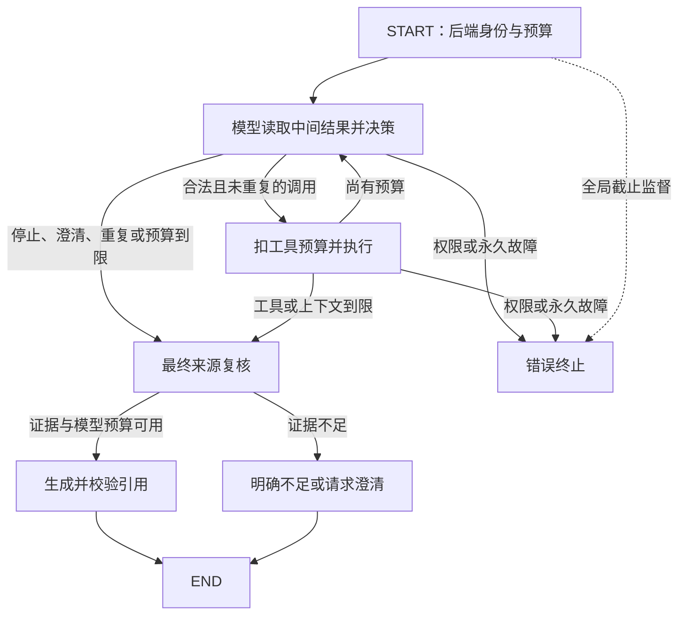

# 有预算的再次检索（第 24B 步）

## 范围与决策过程

`app.agent.loop.run_agent` 新增受限循环，保留第 24A 步 `run_once` 作为单次版本。模型每次看见最新工具状态、错误码、授权片段及查询/证据变化历史，决定改写查询、补读片段、澄清或结束。后端没有固定第二次查询词；测试用固定模型脚本验证实际执行的参数。



没有新增 HTTP、跨请求记忆、写入工具或检索策略。模型可以作多次检索决策，但本步没有真实模型效果实验，不以 fake 脚本证明真实自主检索质量。

## 程序硬限制

| 限制 | 默认及硬上限 | 程序执行点 |
| --- | --- | --- |
| 工具执行 | 3 次 | 执行前 claim_tool，失败执行也计数 |
| 模型请求 | 6 次 | 每次实际 HTTP 尝试前 claim_request；包含决策、Embedding、Chat 及重试 |
| 整轮时间 | 60 秒 | monotonic deadline、网络整次超时、返回结果监督器；只能缩小 |
| 工具结果累计上下文 | 24000 字符 | 累加 ToolResult 紧凑 JSON 长度；超过后不将该正文送模型 |
| 累计返回正文 | 12000 字符 | 复用 KnowledgeTools 的总正文额度，read 也扣减 |
| 每次决策输入 | 32000 字符 | 发送模型前检查序列化 messages；工具定义固定且数量有限 |
| 相同调用 | 只允许 1 次 | 规范化名称与参数指纹，第二次不执行 |

字符数不是 token。最终生成继续使用已有 ContextBudget，为提示、问题和输出预留空间。工具历史不累计保存旧正文，最新 evidence 替代旧 evidence；历史包含查询、状态、证据 ID 变化及输出长度。

`RoundLimits` 是后端 frozen 配置，只能缩小上限，模型不可修改。非最终请求保留最后一个模型请求额度供最终生成使用，因此有时会在第 5 次请求后停止继续检索。最终生成的重试也扣全局额度，绝不能启动第 7 次请求。

相同 query 先去首尾空白、合并连续空白并 casefold；read 参数的 UUID 已规范化，再排序后计算指纹，因此交换 read ID 顺序不能绕过重复检查。重复后尝试基于已有证据完成最终回答，不再执行相同工具。

## 超时与隐藏重试

原固定 RAG 和 24A 不启用新预算上下文。24B 的已知 OpenAI 适配器通过共享 RequestBudget 在每次 `_post` 尝试前扣额度：

- 使用 `AsyncClient` 和 `AsyncHTTPTransport(retries=0)`；不使用有隐藏重试的 SDK，不跟随重定向。
- connect/read/write/pool 超时均取原配置与全局剩余时间的较小值。
- HTTPX 的 read timeout 是读取一段数据的等待时间，不能替代整次请求上限；另用 `asyncio.timeout(remaining)` 限制整个请求。
- 显式的暂时故障重试仍最多 3 次，但每次共享六请求额度，退避也检查截止时间。
- 注入自定义同步 HTTP 客户端不能绕过预算路径，会被拒绝；仅允许 MockTransport 用于离线协议测试。
- 未适配预算的模型客户端直接返回 UNBUDGETED_MODEL_CLIENT，不能事后补计数。已知 fake 客户端每次受控调用模拟一次请求，明确记为 simulated，不自动代替真实故障。

整轮监督器到期后设置取消标记并立即停止等待，返回 deadline 错误，不发布迟到答案。工作线程仅执行只读任务、持有私有 trace；若底层数据库或受控 fake 暂时不可中断，它可能稍后才退出，但后续模型调用会在预算检查处被阻止。不能撤回供应商已经收到的请求或费用，也不宣称强制终止任意 Python/数据库调用。

超时监督器返回 `trace_incomplete=true` 的计数/历史快照，usage 不完整时不填零。不会共享一份仍由工作线程修改的“完整 trace”；成功结束才返回完整 trace_payload。短事件阻塞测试验证不等待阻塞 fake，异步 Event 测试验证 HTTP 协程取消；主要逻辑超时使用可控时钟。

## 终止结果

返回状态保留 original_question、evidence、tool_call_count、model_call_count、deadline、final_result、decision、tool_result、error；增加 termination_reason、history、context_chars、trace_payload。

| termination_reason | 含义 |
| --- | --- |
| model_finished | 模型返回零工具调用，转入最终生成/资料不足 |
| clarification | 模型请求补充条件，后端生成 needs_clarification |
| repeated_call | 相同调用已执行，停止再次执行 |
| tool_budget / model_budget / context_budget | 达到程序额度，停止回边 |
| deadline | 全局时间用完，error=AGENT_DEADLINE_TIMEOUT，无事实答案 |
| error | 权限失败、永久模型错误、非法调用或未恢复的技术故障 |

预算终止与答案状态是两个维度：例如 tool_budget 仍可能在剩余额度内返回 answered；没有证据或无法完成生成时明确返回 insufficient_evidence，不使用训练知识补企业规则。技术故障保持 error，不能把一次 MODEL_TIMEOUT 直接称为“知识库不存在资料”。临时工具故障会进入下一次模型决策，由模型选择是否改写；永久错误和权限错误不会降级绕过。

`request_clarification` 是原生决策的控制信号，不是第三个资料工具。参数只允许 product/time_range/scenario/policy/other 缺失条件枚举，后端拼成澄清句；不采用模型未经证据校验的自然语言答案。信号直接终止，不扣搜索/读取工具额度。

最终生成前后及返回前重新执行当前成员和来源有效性检查，复用已有回答与引用校验。删除、重建或撤权后不返回事实答案。只有最近一次检索授权集合内的块可读；旧 ID 不映射到新文本。合法引用仍不能证明结论被证据支持，事实与蕴含关系需要人工复核。

## 记录实际决策

按第 24B 步的明确要求，此路径的私有 trace 保存实际 query（最多 3 条，每条最多 4000 字符）；这是对此前“默认不记录 query”的局部变更。history 每项包括：

- step、tool、query、参数摘要；
- status、error_code、result_count、output_chars；
- evidence_ids、added、removed、changed（同 ID 片段变化，例如补读延长）。

只向模型提供当前复核后的片段，不把历史旧正文保留在后续提示中。trace 不记录资料全文、完整提示词、密钥配置或思维链。query 自身可能含用户输入，因此 trace 仍属私有资料，不能公开；未来 HTTP 宿主必须使用既有授权查询逻辑。

图显式关闭 LangSmith tracing，不使用 checkpointer。完整 state 含片段，只供可信后端使用；公共响应应只返回 final_result、termination_reason 和安全 error，不直接返回整个 state。trace_payload 可由可信宿主保存，本步仍没有新的公开 Agent HTTP 接口。

## 后端入口

```python
from uuid import uuid4
from app.agent.contracts import RunContext
from app.agent.loop import run_agent
from app.llm.budget import RoundLimits

# verified_user_id 必须来自后端已验证身份；所有工厂是后端依赖。
state = run_agent(
    question,
    context=RunContext(verified_user_id, selected_kb_id, uuid4().hex),
    factory=session_factory,
    profile=embedding_profile,
    embedding_factory=embedding_factory,
    decision_factory=decision_factory,
    chat_factory=chat_factory,
    limits=RoundLimits(),
)
result, reason, error = state["final_result"], state["termination_reason"], state["error"]
```

真实决策工厂使用 `OpenAILoopDecisionClient`，Embedding/最终 Chat 沿用现有 OpenAI 客户端；模型和密钥来自现有 Settings/环境变量。仍使用原模型快照，不新增平台或依赖。每轮新建工具实例，不能把预算外预检索伪装为轮内免费调用。24A 的 run_once 和其计数语义仍保留，本入口的 model_call_count 专指请求尝试数。

## 验收与演示命令（PowerShell）

配置专用 PostgreSQL+pgvector 测试服务器，测试账号需能创建和删除随机临时库。没有数据库配置会跳过集成测试，跳过不算通过。

```powershell
cd backend
uv sync --locked
$env:TEST_POSTGRES_ADMIN_URL = Read-Host "专用测试服务器 URL（postgresql+psycopg://.../postgres）"
uv run --locked pytest -q tests/test_agent_loop.py
uv run --locked pytest -q -s tests/test_agent_loop.py::test_failed_retrieval_result_drives_rewrite_then_success
uv run --locked ruff check .
uv run --locked ruff format --check .
```

第二条测试命令打印本次实际执行的 fake 诊断 JSON：首次查询失败 → 模型改写 → 新增证据 → 最终回答，并包含真实运行计数。它不调用真实模型，也不能说明真实自主检索效果。原始验证日志位于忽略目录 artifacts/validation/step24b/，实测结果见 [progress.md](progress.md)。

## 官方依据

- [HTTPX 超时](https://www.python-httpx.org/advanced/timeouts/)：区分 connect/read/write/pool，read timeout 不等于全流程总时间。
- [HTTPX AsyncClient 与 transport](https://www.python-httpx.org/async/)：异步请求与显式 transport retries；本项目预算路径设为 0。
- [Python asyncio 时间限制](https://docs.python.org/3.12/library/asyncio-task.html#timeouts)：限制协程执行并处理取消；另设返回结果监督器以隔离不可中断操作。
- [LangGraph Graph API](https://docs.langchain.com/oss/python/langgraph/graph-api)：条件边与循环；程序预算优先于提示和 recursion_limit。

知识点：预算必须在副作用发生前检查和扣减。若只在模型返回后累计 call_count，隐藏重试或并发就可能先越限再被发现；本项目把真实请求计数放在发送边界，并共享锁保护的轮次预算。

## 本次实际演示（fake，n=1）

保存于 artifacts/validation/step24b/demo.txt，request_id=`11675c11762a425bbbd43788013bdc67`：

| 步骤 | 实际 query | 结果 | 证据变化 |
| --- | --- | --- | --- |
| 1 | 报销规则 | MODEL_TIMEOUT，technical_failure | 无证据 |
| 2 | 审批期限 680 CNY | success，1 个结果 | 新增 1 个 chunk_id |
| 结束 | 模型选择不再调用工具 | answered，通过既有引用校验 | 使用最新授权片段 |

实际计数为 2 次工具、6 次模型请求、累计工具结果 817 字符；真实模型未运行。这只验证失败状态传给下一次决策、改写参数被执行以及预算没有越限，不是检索质量结论。

工具执行前先记录 running 条目，完成后更新结果与证据变化。如果整轮在工具内部超时，快照仍有已经开始的 query；result_count/output_chars 保持 null，不能填 0 假装已完成且无结果。
