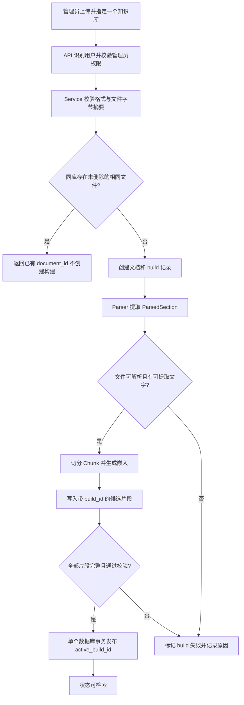
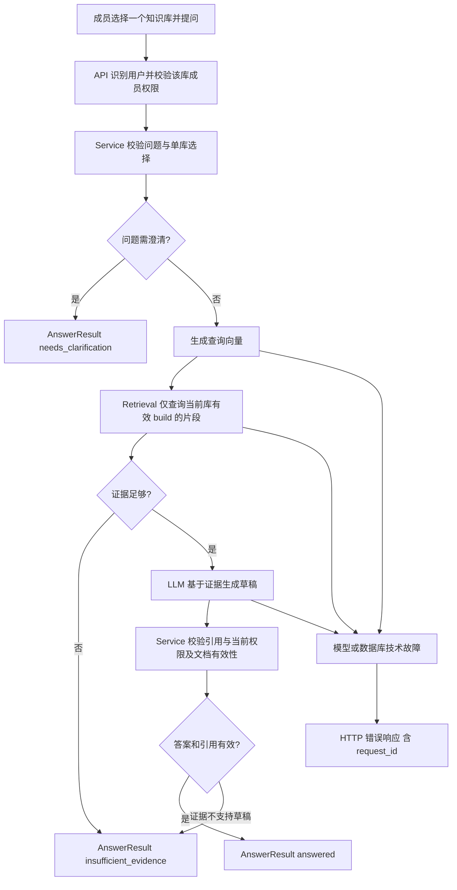

# 企业知识库问答系统架构契约（第 2 步）

本文以 [需求文档](requirements.md) 为依据，约定模块边界、数据契约、接口形状和一致性规则。后续每个编号任务以本文为契约；需要改变字段、状态、权限或接口时，先更新本文再实现。本步只写设计，不创建业务代码或安装依赖。

## 1. 系统边界与选型

- 前端：React + TypeScript，负责选库、上传与状态展示、检索、问答和引用跳转；前端显示的权限不是安全边界。
- API：FastAPI，负责 HTTP 参数校验、可信用户识别、授权入口、响应与错误映射、`request_id`。路由不直接解析文件、访问模型或拼接检索 SQL。
- 业务与持久化：Python services 编排流程；repositories 使用 SQLAlchemy 访问 PostgreSQL；Alembic 管理数据库模式迁移。
- 检索：PostgreSQL 存储文档、构建与片段；模型适配步骤确定嵌入维度后，再通过迁移加入 pgvector 向量列。基础范围将采用单库向量检索，混合检索留给 F1。
- 模型：通过 `llm` 适配层调用可配置的外部模型 API，包括嵌入和生成；密钥只从环境变量读取。供应商、模型及版本在实现相应功能时确定。
- Agent：后续 F3 再使用 LangGraph 编排受限工具调用；基础问答为固定 RAG 流程，不启用 Agent。
- 文件：原始上传文件放在非公开的受控存储中，数据库只保存元数据及内部存储定位；不得提交到 Git。具体本地存储或对象存储方案待实现任务确定。

第 2 步编写本文时尚未安装依赖；第 3 步已在 `backend/uv.lock` 锁定后端依赖。后续引入模型适配等新组件时仍须核对兼容版本并更新锁文件。[FastAPI 多文件应用](https://fastapi.tiangolo.com/tutorial/bigger-applications/)、[SQLAlchemy 事务](https://docs.sqlalchemy.org/en/20/orm/session_transaction.html)、[Alembic 文档](https://alembic.sqlalchemy.org/en/latest/)、[pgvector 官方说明](https://github.com/pgvector/pgvector)、[React TypeScript 指南](https://react.dev/learn/typescript) 和 [LangGraph 概览](https://docs.langchain.com/oss/python/langgraph/overview) 是本设计核对的官方资料。

## 2. 文档入库流程

基础范围可在请求内执行入库，上传请求完成后返回最终状态；未来 F2 将同一 service 流程交给后台任务执行，并可先返回 `202` 和 `task_id`。无论执行方式如何，构建状态和发布规则相同。



上传前校验若发现不支持类型，可直接返回明确的 4xx 错误且不建文档；接受后才发现损坏或扫描件时，build 进入失败态并保存可读原因。两种情况都不得产生可检索内容。重复判定基于同一知识库中未删除文档的原始文件字节摘要；数据库唯一约束处理并发重复上传，返回已有 `document_id`。摘要相同后仍以字节相同为契约，极端碰撞处理方式在实现任务确定。

## 3. 问答流程



检索查询必须在数据库层同时限定 `knowledge_base_id`、未删除文档及 `document.active_build_id = chunk.build_id`。获取片段后，service 只把当前库授权证据传给模型；返回前复核引用仍指向有效文档。明确无证据或草稿无证据支持时返回 `insufficient_evidence`；问题缺少必要限定条件时返回 `needs_clarification`。模型超时、嵌入失败、数据库不可用或校验器自身故障使用错误响应，不能伪装为资料不足。基础范围的“证据足够”判定规则和阈值待实验确定，不能仅凭模型自称有引用就通过。

## 4. 分层职责与依赖方向

依赖方向为 `api → services → repositories / parsers / retrieval / llm`；后续 `agent → services / retrieval / llm`，但 Agent 的工具仍走同一授权和数据访问规则。`contracts` 定义跨层的数据结构，不依赖框架对象。

| 层 | 职责 | 不负责 |
| --- | --- | --- |
| `api` | FastAPI 路由、请求/响应模型、认证依赖、输入校验、HTTP 状态码和 `request_id`；把可信 principal 与单个库 ID 交给 service。 | 文件解析、检索排序、事务编排、直接调用模型。 |
| `services` | 用例编排和授权决策；处理上传去重、构建发布、删除、检索问答、证据与引用校验；明确事务边界。 | HTTP 框架细节、数据库 SQL、供应商 SDK 细节。 |
| `repositories` | 用 SQLAlchemy 执行限定知识库范围的读写、唯一约束及事务；Alembic 维护表结构。 | 决定用户权限或生成回答。 |
| `parsers` | 解析 UTF-8 Markdown/TXT 与文本型 PDF，输出位置可追踪的 `ParsedSection`；识别扫描、损坏和不支持类型。 | 决定授权、调用模型、发布索引。 |
| `retrieval` | 依据单库与有效 build 过滤候选片段，排序并输出 `RetrievedChunk`；后续扩展混合检索。 | 跨库搜索、绕过授权、生成自然语言答案。 |
| `llm` | 封装嵌入和生成模型 API、超时及错误分类；支持可控 fake 实现供单元测试使用。 | 决定哪些用户可见、保存数据库记录。 |
| `agent` | 后续用 LangGraph 实现有限步状态流转、工具白名单和调用计数；复用 service 的授权检查。 | 绕过固定权限边界或在基础阶段接管普通问答。 |

`api` 不接受请求体中的 `user_id` 作为授权依据；即使客户端传入也必须拒绝或忽略。所有入口使用后端从可信认证凭据解析出的用户身份。`knowledge_base_id` 是资源选择参数，不是授权凭据。每个文档、任务、来源查询都要同时校验所属库和用户在该库的角色，防止直接猜测 ID 越权。

## 5. 数据契约与定位

下列字段名采用 JSON 风格 `snake_case`；Python 内部对象也沿用相同语义。`id` 字段是稳定的不透明标识，示例用字符串；具体 UUID 或其他生成方式在实现任务确定。页码从 1 开始；`heading_path` 为从上到下的标题数组；TXT 可使用行号。可空字段在 JSON 中用 `null`。

| 对象 | 必需字段与类型 | 可空字段与约束 |
| --- | --- | --- |
| `ParsedSection` | `document_id: str`, `section_index: int`, `text: str` | `page_number: int?`, `heading_path: list[str]?`, `start_line: int?`, `end_line: int?`；必须至少有页码、标题路径或行号之一。 |
| `Chunk` | `chunk_id: str`, `document_id: str`, `build_id: str`, `knowledge_base_id: str`, `ordinal: int`, `text: str` | 同上四个定位字段；继承原文位置，不能跨文档或构建拼接。数据库 `chunks` 表通过 `build_id` 关联文档和知识库，读取时派生 `document_id`、`knowledge_base_id`；向量列在模型适配步骤增加，不暴露给 API。 |
| `RetrievedChunk` | `chunk_id: str`, `document_id: str`, `build_id: str`, `knowledge_base_id: str`, `text: str`, `score: float` | 同上定位字段；`score` 是所用检索器的排序值，不承诺跨算法可比。仅可来自当前库的有效 build。 |
| `Citation` | `citation_id: str`, `document_id: str`, `build_id: str`, `chunk_id: str`, `document_name: str`, `snippet: str`, `source_path: str` | 同上定位字段；`source_path` 指向需重新授权的来源接口，不能是公开文件地址。 |
| `AnswerResult` | `status: "answered" \| "insufficient_evidence" \| "needs_clarification"`, `answer: str`, `citations: list[Citation]`, `request_id: str` | `answered` 必须有非空、经校验的引用；其余两种状态的 `citations` 为空，`answer` 分别写明资料不足或需要补充什么。 |

文档定位的最小稳定组合为 `document_id + build_id + chunk_id + 页码或标题路径/行号`。引用带 `build_id`，因此重建索引后不会意外指向另一版片段；来源接口每次重新检查文档未删除、用户有权访问，且只返回该引用对应的资料。若旧构建已清理，返回来源不可用错误，不能映射到当前构建的同序号片段。

## 6. 数据模型、状态与发布规则

第 4 步的核心表为 `users`、`knowledge_bases`、`kb_members(user_id, kb_id, role)`、`documents(id, kb_id, file_name, file_sha256, deleted_at, active_build_id)`、`document_builds(id, document_id, status, parser_config, chunking_config, model_config_id, error_code, error_message, created_at, finished_at)` 和 `chunks(id, build_id, ordinal, body, content_sha256, page_number, heading_path, start_line, end_line)`；文档的私有文件存储定位也保存在 `documents.storage_key`。`chunks` 的文档及知识库归属由 build 和 document 外键链确定，避免重复列失配。`kb_members` 对用户与知识库组合唯一；未删除文档的同库文件摘要唯一；`active_build_id` 必须引用本文件的构建。向量列及维度待模型适配步骤确定后再通过迁移加入；F2 时增加 `tasks`。

核心表采用 Alembic 显式迁移，应用启动不调用 `create_all`。`active_build_id` 使用 `(documents.id, active_build_id)` 到 `(document_builds.document_id, id)` 的组合外键，防止指向其他文档的构建；可检索块查询还需检查当前库、未删除和 build 状态为 `ready`。表定义与迁移用法参考 [SQLAlchemy 声明式映射](https://docs.sqlalchemy.org/en/20/orm/declarative_tables.html)、[PostgreSQL 方言](https://docs.sqlalchemy.org/en/20/dialects/postgresql.html) 和 [Alembic 迁移教程](https://alembic.sqlalchemy.org/en/latest/tutorial.html)。

构建状态：`queued → processing → ready` 或 `queued/processing → failed`。`ready` 表示该 build 的全部解析、分块、向量及索引记录已经完成并校验；只有被 `documents.active_build_id` 指向的 ready build 才对检索生效。`failed` 必须有机器可识别的错误码和供管理员查看的安全说明。文档对外状态至少有 `processing`、`ready`、`failed`、`deleted`；若重建失败但旧 active build 仍在，文档保持 `ready`，同时展示最新构建 `failed` 及原因。F2 的任务状态可映射到构建状态，但任务不是引用来源。

发布时在同一个 PostgreSQL 事务内核对构建仍属该文档、状态为 ready、片段完整、文档未删除；引入向量列后还须核对向量齐全，再切换 `active_build_id`。首次构建未完整成功前指针为空；重建期间旧指针继续服务，失败时指针不变。检索和来源查询仅查询有效指针；候选写入再多也不可见。删除在事务中设置 `deleted_at` 并清空指针，删除成功后新请求立即不可见；物理文件及旧片段的清理可稍后执行，但来源接口也必须检查删除标记。发布与删除竞争时用文档行锁或等效条件更新串行化，不能让已删除文档重新发布。

## 7. 授权与错误规则

- 认证：API 从后端验证的会话或令牌得到 principal；认证方案在实现前确定。未认证返回 `401`。不得读取请求体 `user_id` 决定身份。
- 知识库权限：管理员可上传、查看处理状态、删除、管理成员，并具有成员能力；成员可检索、问答、查看授权来源；未加入的用户不可访问。未知库或无成员资格建议统一返回 `404`，避免泄露库是否存在；已授权成员尝试管理员操作返回 `403`。
- 所有列表、详情、任务、引用、检索 SQL 都带知识库约束；先按可信 principal 检查 membership，再按同库资源 ID 查询。前端隐藏按钮仅改善体验，不能代替后端检查。
- 参数或格式错误返回 `400/415/422` 中合适状态，错误体说明原因；冲突依照接口语义返回 `409`。模型、存储或数据库故障返回 `5xx` 与可追踪错误码。内部堆栈和密钥不能返回客户端。
- 每次请求生成或透传受控的 `request_id`，成功响应和错误响应均包含它；日志记录关联 ID，避免记录密钥和完整私有文档。

技术故障错误体统一为 `{ "error": { "code": "...", "message": "..." }, "request_id": "..." }`，不用 `AnswerResult.status` 表达故障。`insufficient_evidence` 只表示业务上没有足够的授权证据。

后续实现权限、检索、一致性及错误处理前，至少按下列契约检查编写有价值的测试；真实模型效果另行测量：

| 边界 | 可执行检查 |
| --- | --- |
| 可信身份 | 请求体伪造其他 `user_id`，仍按后端 principal 判权；未授权库的搜索、回答、来源和任务均不泄露内容。 |
| 单库检索 | A、B 库有各自独有事实时，A 库查询只返回 A 的有效 build；省略或传入多个库被拒绝。 |
| 构建发布 | 构建仅写入部分片段或向量失败时，`active_build_id` 不改变，新片段不可检索；完整成功后一次切换。 |
| 发布与删除竞争 | 删除成功后即使旧构建稍后结束，也不能恢复有效指针；新检索与旧引用均无法读取已删除内容。 |
| 回答与引用 | fake 模型分别返回有效引用、无证据、需澄清和编造引用，检查三个业务状态及引用校验。 |
| 技术故障 | fake 模型超时及数据库异常分别产生带 `request_id` 的错误响应，而非 `insufficient_evidence`。 |

## 8. HTTP 接口规划

以下为目标接口形状，不表示已实现。路径版本前缀为 `/api/v1`。除认证入口外均需认证；`{kb_id}` 在路径中指定且仅有一个。接口与阶段按需求 R1–R9、F2 对应。创建知识库时，创建者成为该库管理员；演示账号的建立方式待认证方案确定。

| 分类 | 方法与路径 | 权限 | 主要请求 / 响应 |
| --- | --- | --- | --- |
| 认证 | `POST /auth/session`, `GET /auth/me`, `DELETE /auth/session` | 登录入口 / 已认证 | 建立、查询、撤销会话；`me` 返回后端识别的用户 ID。认证凭据格式待定。 |
| 知识库 | `GET /knowledge-bases`, `POST /knowledge-bases`, `GET /knowledge-bases/{kb_id}` | 已认证；详情需成员 | 仅列出有权访问的库；创建者为管理员。 |
| 成员授权 | `GET /knowledge-bases/{kb_id}/members`, `PUT /knowledge-bases/{kb_id}/members/{member_id}` | 管理员 | 查看、授予或调整该库成员角色；不能通过此接口读取其他库成员。 |
| 文档 | `POST /knowledge-bases/{kb_id}/documents`, `GET /knowledge-bases/{kb_id}/documents`, `GET /knowledge-bases/{kb_id}/documents/{document_id}`, `DELETE /knowledge-bases/{kb_id}/documents/{document_id}` | 管理员 | 上传、列表与状态、详情、删除；重复上传返回已有 ID。 |
| 来源 | `GET /knowledge-bases/{kb_id}/sources/{document_id}/{build_id}/{chunk_id}` | 成员或管理员 | 返回授权片段及位置；删除或无权时不返回内容。 |
| 检索 | `POST /knowledge-bases/{kb_id}/search` | 成员或管理员 | 请求 `{ "query": "..." }`，返回当前库有效构建的片段和定位。 |
| 问答 | `POST /knowledge-bases/{kb_id}/answers` | 成员或管理员 | 请求 `{ "question": "..." }`，返回 `AnswerResult`。 |
| 任务查询 | `GET /knowledge-bases/{kb_id}/tasks/{task_id}` | 管理员 | F2 启用；返回任务、文档、构建状态与安全的失败原因。基础阶段可保留接口契约，未启用时不假装后台任务存在。 |

上传使用 `multipart/form-data`，文件字段名 `file`。基础范围可在处理完成后返回 `201`，响应携带 `document_id`、`build_id`、最终状态和 `request_id`；重复上传返回 `200` 和原 `document_id`。F2 引入后台入库后，可返回 `202`、`task_id`、初始状态和查询路径。调用者始终以文档状态而非上传 HTTP 成功与否判断是否可检索。

### 请求与响应示例

示例 1：单库问答，请求 `POST /api/v1/knowledge-bases/kb_a/answers`：

```json
{ "question": "差旅报销需要在几天内提交？" }
```

成功回答 `200`：

```json
{
  "status": "answered",
  "answer": "模拟制度要求在出差结束后 10 天内提交。",
  "citations": [
    {
      "citation_id": "c1",
      "document_id": "doc_1",
      "build_id": "build_1",
      "chunk_id": "chunk_3",
      "document_name": "模拟差旅制度.pdf",
      "snippet": "出差结束后 10 天内提交报销材料。",
      "source_path": "/api/v1/knowledge-bases/kb_a/sources/doc_1/build_1/chunk_3",
      "page_number": 2,
      "heading_path": null,
      "start_line": null,
      "end_line": null
    }
  ],
  "request_id": "req_123"
}
```

资料不足也返回 `200`，例如 `{ "status": "insufficient_evidence", "answer": "当前知识库没有足够资料回答这个问题。", "citations": [], "request_id": "req_124" }`。需要澄清时使用 `needs_clarification`，在 `answer` 中说明缺少的条件，引用为空。

模型服务超时示例 `504`：

```json
{ "error": { "code": "MODEL_TIMEOUT", "message": "模型服务暂时不可用" }, "request_id": "req_125" }
```

文档上传请求示例：`POST /api/v1/knowledge-bases/kb_a/documents`，`multipart/form-data` 中发送 `file=@sample.pdf`。基础范围的成功响应示例 `201`：

```json
{ "document_id": "doc_1", "build_id": "build_1", "status": "ready", "request_id": "req_126" }
```

F2 任务查询响应示例 `200`：

```json
{ "task_id": "task_1", "document_id": "doc_1", "build_id": "build_2", "status": "processing", "error": null, "request_id": "req_127" }
```

## 9. 建议目录结构

目录是未来实现的边界建议，不要求在本步创建。按编号任务逐步落地，避免一次性生成空模块。

```text
ragdesk/
├── backend/
│   ├── app/
│   │   ├── main.py
│   │   ├── api/              # 路由、请求/响应模型、认证依赖
│   │   ├── contracts/        # ParsedSection、Chunk 等跨层契约
│   │   ├── services/         # 用例、授权、构建发布、问答编排
│   │   ├── repositories/     # SQLAlchemy 查询与持久化
│   │   ├── parsers/          # Markdown、TXT、文本型 PDF
│   │   ├── retrieval/        # 单库有效构建检索；后续混合检索
│   │   ├── llm/              # 模型 API 适配器和 fake 实现
│   │   └── agent/            # F3 时加入 LangGraph
│   ├── alembic/              # 模式迁移
│   └── tests/
├── frontend/
│   └── src/                  # React + TypeScript 页面与 API 客户端
└── docs/
```

## 10. PostgreSQL + pgvector 的取舍

模拟企业资料规模待测，优先把成员关系、文档状态、有效构建指针、片段和向量放在同一个数据库中。这样可以用同一事务发布完整构建和撤销删除文档，用 SQL 将知识库授权范围与向量候选绑定，并减少演示项目的部署部件。pgvector 官方文档支持精确最近邻查询及 HNSW、IVFFlat 索引；基础阶段先以精确查询建立正确性基线，索引及参数由真实数据量和测量结果决定。后续 F1 可结合 PostgreSQL 全文检索做混合检索。[pgvector 官方说明](https://github.com/pgvector/pgvector)、[PostgreSQL 事务说明](https://www.postgresql.org/docs/current/tutorial-transactions.html)。

暂不引入独立搜索集群，是当前规模未知、需要优先验证权限和数据一致性的工程取舍，不是性能结论。单库方案的潜在代价是大型向量索引、复杂排序或高查询负载可能与事务型工作负载争用资源；pgvector 近似索引在过滤知识库后也可能漏掉候选。届时记录语料规模、查询计划、延迟和召回实验，再决定是否增加索引、分区或独立搜索系统；迁移时仍须保持本契约的单库授权与完整构建发布语义。
