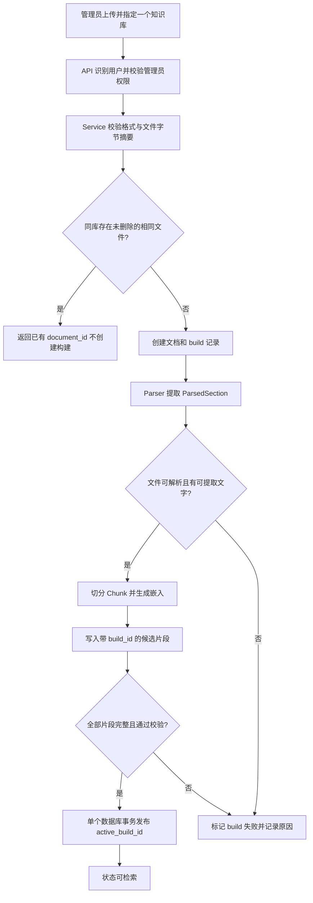
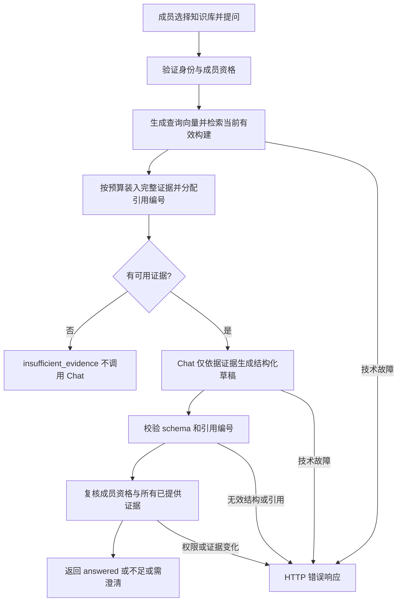
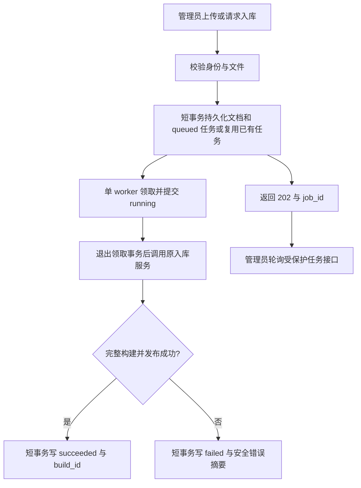

# 企业知识库问答系统架构契约（第 2 步）

本文以 [需求文档](requirements.md) 为依据，约定模块边界、数据契约、接口形状和一致性规则。后续每个编号任务以本文为契约；需要改变字段、状态、权限或接口时，先更新本文再实现。本步只写设计，不创建业务代码或安装依赖。

## 1. 系统边界与选型

- 前端：React + TypeScript，负责选库、上传与状态展示、检索、问答和引用跳转；前端显示的权限不是安全边界。
- API：FastAPI，负责 HTTP 参数校验、可信用户识别、授权入口、响应与错误映射、`request_id`。路由不直接解析文件、访问模型或拼接检索 SQL。
- 业务与持久化：Python services 编排流程；repositories 使用 SQLAlchemy 访问 PostgreSQL；Alembic 管理数据库模式迁移。
- 检索：PostgreSQL 存储文档、构建与片段；模型适配步骤确定嵌入维度后，再通过迁移加入 pgvector 向量列。基础范围将采用单库向量检索，混合检索留给 F1。
- 模型：第 12 步固定首个供应商为 OpenAI；`llm` 适配层分别配置嵌入和生成模型，密钥只从环境变量读取。模型标识、维度和输入约定见 [模型配置](model_config.md)。
- Agent：后续 F3 再使用 LangGraph 编排受限工具调用；基础问答为固定 RAG 流程，不启用 Agent。
- 文件：原始上传文件放在非公开的受控存储中，数据库只保存元数据及内部存储定位；不得提交到 Git。具体本地存储或对象存储方案待实现任务确定。

第 2 步编写本文时尚未安装依赖；第 3 步已在 `backend/uv.lock` 锁定后端依赖。后续引入模型适配等新组件时仍须核对兼容版本并更新锁文件。[FastAPI 多文件应用](https://fastapi.tiangolo.com/tutorial/bigger-applications/)、[SQLAlchemy 事务](https://docs.sqlalchemy.org/en/20/orm/session_transaction.html)、[Alembic 文档](https://alembic.sqlalchemy.org/en/latest/)、[pgvector 官方说明](https://github.com/pgvector/pgvector)、[React TypeScript 指南](https://react.dev/learn/typescript) 和 [LangGraph 概览](https://docs.langchain.com/oss/python/langgraph/overview) 是本设计核对的官方资料。

## 2. 文档入库流程

基础范围可在请求内执行入库，上传请求完成后返回最终状态；未来 F2 将同一 service 流程交给后台任务执行，并可先返回 `202` 和 `task_id`。无论执行方式如何，构建状态和发布规则相同。


```mermaid
flowchart TD
    A[管理员上传并指定一个知识库] --> B[API 识别用户并校验管理员权限]
    B --> C[Service 校验格式与文件字节摘要]
    C --> D{同库存在未删除的相同文件?}
    D -- 是 --> E[返回已有 document_id 不创建构建]
    D -- 否 --> F[创建文档和 build 记录]
    F --> G[Parser 提取 ParsedSection]
    G --> N{文件可解析且有可提取文字?}
    N -- 是 --> H[切分 Chunk 并生成嵌入]
    H --> I[写入带 build_id 的候选片段]
    I --> J{全部片段完整且通过校验?}
    J -- 是 --> K[单个数据库事务发布 active_build_id]
    K --> L[状态可检索]
    J -- 否 --> M[标记 build 失败并记录原因]
    N -- 否 --> M
```

上传前校验若发现不支持类型，可直接返回明确的 4xx 错误且不建文档；接受后才发现损坏或扫描件时，build 进入失败态并保存可读原因。两种情况都不得产生可检索内容。重复判定基于同一知识库中未删除文档的原始文件字节摘要；数据库唯一约束处理并发重复上传，返回已有 `document_id`。摘要相同后仍以字节相同为契约，极端碰撞处理方式在实现任务确定。

## 3. 问答流程


```mermaid
flowchart TD
    A[成员选择知识库并提问] --> B[验证身份与成员资格]
    B --> C[生成查询向量并检索当前有效构建]
    C --> D[按预算装入完整证据并分配引用编号]
    D --> E{有可用证据?}
    E -- 否 --> F[insufficient_evidence 不调用 Chat]
    E -- 是 --> G[Chat 仅依据证据生成结构化草稿]
    G --> H[校验 schema 和引用编号]
    H --> I[复核成员资格与所有已提供证据]
    I --> J[返回 answered 或不足或需澄清]
    C -- 技术故障 --> K[HTTP 错误响应]
    G -- 技术故障 --> K
    H -- 无效结构或引用 --> K
    I -- 权限或证据变化 --> K
```

检索查询必须在数据库层同时限定 `knowledge_base_id`、未删除文档及 `document.active_build_id = chunk.build_id`。获取片段后，service 只把当前库授权证据传给模型；返回前复核引用仍指向有效文档。明确无证据或草稿无证据支持时返回 `insufficient_evidence`；问题缺少必要限定条件时返回 `needs_clarification`。模型超时、嵌入失败、数据库不可用或校验器自身故障使用错误响应，不能伪装为资料不足。基础范围的“证据足够”判定规则和阈值待实验确定，不能仅凭模型自称有引用就通过。

第 15 步采用固定流程：认证与成员校验 → 现有向量检索 → 按排名装入完整证据块 → 一次 Chat 生成 → 结构与引用校验 → 再校验当前权限和证据有效性。实际装入上下文的候选分配本次请求的 `c1`、`c2` 等编号；模型只输出 `status`、`answer`、`citation_ids`，文档元数据和原文由后端补齐。`answered` 必须有非空合法引用；缺失、未知、重复引用或不合 schema 的返回为 `502`，模型超时为 `504`。空证据直接返回 `insufficient_evidence`，不调用 Chat；有片段但不能回答时由模型明确不足或请求澄清。冲突须列出各方说法与引用，不擅自选择统一结论。

预算由 `ContextBudget` 控制，默认总额度 16384、输出预留 1024 token、消息封装安全余量 1024；以完整消息 JSON 与 schema 的 UTF-8 字节数保守计量输入，不声称是精确 token 计数。系统提示、问题、schema 先占预算，剩余空间按排名装入完整块，不截断例外条款；省略块时向模型标明范围不完整，全部放不下返回资料不足。Chat 请求显式设置 `max_completion_tokens=1024`。这些是应用调用上限，更换模型须复核窗口与计量方式。

系统提示要求只依据证据；资料内的命令和伪造角色均为不可信资料。证据 JSON 只放用户消息，不插入系统指令。**引用 ID 合法只验证来源，不能自动证明答案受证据支持**；冲突识别与抵抗提示注入的真实效果须独立实验。返回前重新查询已提供证据，删除、构建切换或内容变化返回 `409 EVIDENCE_CHANGED`，成员撤销返回 `404`。`GET /knowledge-bases/{kb_id}/sources/{document_id}/{build_id}/{chunk_id}` 复用成员授权、校验完整 ID 链、当前 ready 构建和删除状态，返回真实正文、页码、标题、行号。第 21 步：真实旧 ready 构建的引用对当前成员返回 `410 SOURCE_EXPIRED`；删除、未知、伪造链或无权限来源仍统一 `404`。

## 4. 分层职责与依赖方向

依赖方向为 `api → services → repositories / parsers / retrieval / llm`；后续 `agent → services / retrieval / llm`，但 Agent 的工具仍走同一授权和数据访问规则。`contracts` 定义跨层的数据结构，不依赖框架对象。

| 层 | 职责 | 不负责 |
| --- | --- | --- |
| `api` | FastAPI 路由、请求/响应模型、认证依赖、输入校验、HTTP 状态码和 `request_id`；把可信 principal 与单个库 ID 交给 service。 | 文件解析、检索排序、事务编排、直接调用模型。 |
| `services` | 用例编排和授权决策；处理上传去重、构建发布、删除、检索问答、证据与引用校验；明确事务边界。 | HTTP 框架细节、数据库 SQL、供应商 SDK 细节。 |
| `repositories` | 用 SQLAlchemy 执行限定知识库范围的读写、唯一约束及事务；Alembic 维护表结构。 | 决定用户权限或生成回答。 |
| `parsers` | 解析 UTF-8 Markdown/TXT 与文本型 PDF，输出位置可追踪的 `ParsedSection`；识别扫描、损坏和不支持类型。 | 决定授权、调用模型、发布索引。 |
| `retrieval` | 依据单库与有效 build 过滤候选片段，排序并输出 `RetrievedChunk`；后续扩展混合检索。 | 跨库搜索、绕过授权、生成自然语言答案。 |
| `llm` | 封装嵌入和生成模型 API、超时及错误分类；支持可控 fake 实现供单元测试使用。 | 决定哪些用户可见、保存数据库记录。 |
| `agent` | 后续用 LangGraph 实现有限步状态流转、工具白名单和调用计数；复用 service 的授权检查。 | 绕过固定权限边界或在基础阶段接管普通问答。 |

`api` 不接受请求体中的 `user_id` 作为授权依据；即使客户端传入也必须拒绝或忽略。所有入口使用后端从可信认证凭据解析出的用户身份。`knowledge_base_id` 是资源选择参数，不是授权凭据。每个文档、任务、来源查询都要同时校验所属库和用户在该库的角色，防止直接猜测 ID 越权。

## 5. 数据契约与定位

下列字段名采用 JSON 风格 `snake_case`；Python 内部对象也沿用相同语义。`id` 字段是稳定的不透明标识，示例用字符串；具体 UUID 或其他生成方式在实现任务确定。页码从 1 开始；`heading_path` 为从上到下的标题数组；TXT 可使用行号。可空字段在 JSON 中用 `null`。

| 对象 | 必需字段与类型 | 可空字段与约束 |
| --- | --- | --- |
| `ParsedSection` | `section_index: int`, `text: str`, `source_locator: str`, `block_type: "paragraph" \| "list" \| "code"` | `document_id: str?`, `page_number: int?`, `heading_path: list[str]?`, `start_line: int?`, `end_line: int?`；必须至少有页码、标题路径或行号之一。解析器只接收受控文件路径，可选 `document_id` 由调用方传入，独立预览时为 `null`；`section_index` 从 0 开始。Markdown/TXT 使用原文行号范围，`page_number` 为 `null`；PDF 使用从 1 开始的物理页码作为 `page_number` 和 `source_locator`，行号为 `null`，每个有文字的页面至少独立成一个 section。 |
| `Chunk` | `chunk_id: str`, `document_id: str`, `build_id: str`, `knowledge_base_id: str`, `ordinal: int`, `text: str` | 同上四个定位字段；继承原文位置，不能跨文档或构建拼接。数据库 `chunks` 表通过 `build_id` 关联文档和知识库，读取时派生 `document_id`、`knowledge_base_id`；向量列在模型适配步骤增加，不暴露给 API。 |
| `RetrievedChunk` | `chunk_id: str`, `document_id: str`, `build_id: str`, `knowledge_base_id: str`, `document_name: str`, `text: str`, `distance: float?`, `rank: int` | `page_number: int?`, `heading_path: list[str]?`；第 14 步的 `distance` 是 pgvector cosine distance，越小越相似，不是答案正确概率；`rank` 从 1 开始。仅可来自当前库的有效 build。第 17 步增加 `bm25_score: float?`，BM25 返回 `distance=null`、BM25 原始分数（越大排名越前，可为零或负数）；向量结果 `bm25_score=null`。两类原始分数不直接相加。第 18 步新增 `rrf_score: float?`、`vector_rank: int?`、`bm25_rank: int?`，只用两路排名计算融合，原始分数保留供诊断。 |
| `Citation` | `citation_id: str`, `document_id: str`, `build_id: str`, `chunk_id: str`, `document_name: str`, `snippet: str`, `source_path: str` | 同上定位字段；`source_path` 指向需重新授权的来源接口，不能是公开文件地址。 |
| `AnswerResult` | `status: "answered" \| "insufficient_evidence" \| "needs_clarification"`, `answer: str`, `citations: list[Citation]`, `request_id: str` | `answered` 必须有非空、经校验的引用；其余两种状态的 `citations` 为空，`answer` 分别写明资料不足或需要补充什么。 |

文档定位的最小稳定组合为 `document_id + build_id + chunk_id + 页码或标题路径/行号`。引用带 `build_id`，因此重建索引后不会意外指向另一版片段；来源接口每次重新检查文档未删除、用户有权访问，且只返回该引用对应的资料。若旧构建已清理，返回来源不可用错误，不能映射到当前构建的同序号片段。

第 9 步仅解析 UTF-8 或带 UTF-8 BOM 的 Markdown/TXT。解析输出保留标题层级、列表标记、代码围栏及原文行号；标题本身作为 `heading_path`，不单独成为正文片段。普通块清理首尾空白与空行，代码围栏内部保持原样。解析器不执行代码、不请求链接；缺文件、错误编码、空正文和未闭合代码围栏返回可识别的解析错误。此步不写入 `chunks` 或调用嵌入模型。

第 10 步的 `parse_pdf(path, document_id?)` 使用 pypdf，返回 `PdfParseResult(sections: list[ParsedSection], warnings: list[PdfPageWarning], status: "complete" | "partial")`。`PdfPageWarning` 包含 `page_number`、`source_locator`、`code`、`message`；每个没有可提取文字的物理页均有警告：无图片页为 `PDF_NO_TEXT_PAGE`，检测到图片的页为 `PDF_IMAGE_ONLY_PAGE`（疑似扫描页，不能仅凭图片断言来源）。有文字与无文字页面混合时只返回有文字页面的 sections，状态为 `partial`；后续构建服务不得把 `partial` 当作完整成功发布为可检索构建，须报告警告并按不完整构建处理。整份无可提取文字、加密或损坏时抛出稳定错误码，不返回“完整成功”。文本清理只去除无意义的行首尾空白，不改写金额、日期或编号。当前不支持 OCR、复杂表格结构恢复或复杂双栏排版；带隐藏 OCR 文字层的扫描件及图片中的关键信息无法由 pypdf 保证识别。

第 11 步的纯函数 `chunk_sections(sections, config)` 返回 `ChunkingResult(chunks: list[ChunkDraft], stats: ChunkStats)`；`ChunkConfig` 默认 `chunk_size=600`、`overlap=80`，单位是 Python 字符串的 Unicode 码点数，不是模型 token，要求整数且 `chunk_size > 0`、`0 <= overlap < chunk_size`。草稿含文档 ID（可空）、从 0 开始的 `ordinal`、`text`、内容 SHA-256、标题路径、物理页码、起止行号及 `source_spans`。每个 `ChunkSourceSpan` 保存原 `section_index`、`source_locator`、在该 section 文本中的 `[char_start, char_end)` 字符范围及可用的精确行号/页码；草稿不生成 `chunk_id`、`build_id` 或向量。按同一文档、标题路径和页码组合短段落；代码块独立；拆分优先段落、句子，再按字符硬切。PDF 不跨物理页，overlap 只在同一组合内拆分长文本时使用，短文本只产一个草稿。`ChunkStats` 至少记录块数、输入/输出字符数、最短/最长/平均长度、短块数、超限块数、完全重复块数；短块阈值为 `chunk_size` 的一半。完全重复按块正文的 SHA-256 统计，不代表语义重复。后续持久化时再为草稿分配数据库 ID 并核对构建归属。

第 12 步约定 `EmbeddingClient.embed_documents(texts)` 与 `embed_query(text)` 均返回 `EmbeddingResult(vectors, usage, elapsed_ms, call_count)`；查询结果只有一个向量。`ChatClient.generate(messages, response_schema)` 返回 `ChatResult(content, usage, elapsed_ms, call_count)`，其中 `content` 是按 JSON Schema 校验的对象。`usage` 分别记录输入、输出和总 token；`call_count` 包含本次重试尝试，客户端累计调用次数另行可读。参数或响应错误、鉴权失败和向量校验失败不得重试或变成资料不足；仅临时网络、超时、429 和指定 5xx 做最多三次尝试。fake 客户端需由测试显式构造，真实客户端缺密钥或失败时不能回退 fake。本步只实现适配层，不连接检索、问答或构建发布。

第 13 步的本地 `ingest_document` 命令只处理已上传的一份私有文件，由持有数据库连接凭据的本地操作人显式调用，不对外提供 HTTP 入口。命令创建 `processing` 构建并记录解析版本、切块配置、Embedding 提供方/模型/维度及编码约定版本；退出事务后验证原文件摘要、解析、切块并按批调用 Embedding。每批在短事务中写候选块与向量；全部成功后以知识库行锁串行化发布，核对连续序号、预期总数、向量非空、文档未删除及同库其他有效构建的 Embedding 配置一致，再在短事务中标记 `ready` 并更新 `active_build_id`。失败构建标记 `failed`，旧 active build 不变。重复执行同一 `build_id` 不追加块或重复调用模型；失败构建需要新的 ID 才能重建。查询必须带完整的 Embedding 配置标识，且只读取匹配配置、非空向量的有效构建；不同配置不能混入同一有效知识库索引。PDF 部分解析不发布。本步不提供相似度排序或问答。

## 6. 数据模型、状态与发布规则

第 4 步的核心表为 `users`、`knowledge_bases`、`kb_members(user_id, kb_id, role)`、`documents(id, kb_id, file_name, file_sha256, deleted_at, active_build_id)`、`document_builds(id, document_id, status, parser_config, chunking_config, model_config_id, error_code, error_message, created_at, finished_at)` 和 `chunks(id, build_id, ordinal, body, content_sha256, page_number, heading_path, start_line, end_line)`；文档的私有文件存储定位也保存在 `documents.storage_key`。`chunks` 的文档及知识库归属由 build 和 document 外键链确定，避免重复列失配。`kb_members` 对用户与知识库组合唯一；未删除文档的同库文件摘要唯一；`active_build_id` 必须引用本文件的构建。第 13 步通过迁移增加 `chunks.embedding vector(1536)` 与原文 span JSON，并为构建增加 Embedding 提供方、模型、维度、配置版本和预期块数；旧行允许空值，但查询排除空向量。第 20A 步增加 `ingestion_jobs`，见本文末尾任务契约。

核心表采用 Alembic 显式迁移，应用启动不调用 `create_all`。`active_build_id` 使用 `(documents.id, active_build_id)` 到 `(document_builds.document_id, id)` 的组合外键，防止指向其他文档的构建；可检索块查询还需检查当前库、未删除和 build 状态为 `ready`。第 5 步为 `users` 增加可空的 `login_name` 与 `password_hash`，使第 4 步已有的无登录资料用户仍可保留；仅演示初始化命令创建带 Argon2id 哈希的可登录用户。表定义与迁移用法参考 [SQLAlchemy 声明式映射](https://docs.sqlalchemy.org/en/20/orm/declarative_tables.html)、[PostgreSQL 方言](https://docs.sqlalchemy.org/en/20/dialects/postgresql.html) 和 [Alembic 迁移教程](https://alembic.sqlalchemy.org/en/latest/tutorial.html)。

构建状态：`queued → processing → ready` 或 `queued/processing → failed`。`ready` 表示该 build 的全部解析、分块、向量及索引记录已经完成并校验；只有被 `documents.active_build_id` 指向的 ready build 才对检索生效。`failed` 必须有机器可识别的错误码和供管理员查看的安全说明。文档对外状态至少有 `uploaded`、`processing`、`ready`、`failed`、`deleted`；第 8 步只保存原文件且不创建 build，因此新文档为 `uploaded`、`active_build_id` 为空且不可检索。若重建失败但旧 active build 仍在，文档保持 `ready`，同时展示最新构建 `failed` 及原因。F2 的任务状态可映射到构建状态，但任务不是引用来源。

发布时在同一个 PostgreSQL 事务内核对构建仍属该文档、状态为 ready、片段完整、文档未删除；引入向量列后还须核对向量齐全，再切换 `active_build_id`。首次构建未完整成功前指针为空；重建期间旧指针继续服务，失败时指针不变。检索和来源查询仅查询有效指针；候选写入再多也不可见。删除在事务中设置 `deleted_at` 并清空指针，删除成功后新请求立即不可见；物理文件及旧片段的清理可稍后执行，但来源接口也必须检查删除标记。发布与删除竞争时用文档行锁或等效条件更新串行化，不能让已删除文档重新发布。

## 7. 授权与错误规则

- 认证：第 5 步提供 `POST /auth/session` 和 `GET /auth/me`。演示用户由显式命令创建，不设默认密码；密码只以 Argon2id 哈希保存。登录成功签发有 `sub`（用户 UUID）、`iat` 和 `exp` 的 Bearer JWT；签名算法固定为 HS256，服务端仅从环境变量读取签名密钥。后端校验签名、算法、必需声明、过期时间及用户仍存在后，才把 `sub` 作为 principal。缺失或无效令牌返回 `401`；错误密码与不存在账号返回相同响应。不得读取请求体 `user_id` 决定身份。第 5 步不实现知识库角色授权，也不提供注册、找回密码、短信登录、刷新令牌或 SSO。用法参考 [FastAPI JWT 教程](https://fastapi.tiangolo.com/tutorial/security/oauth2-jwt/)、[PyJWT 过期声明](https://pyjwt.readthedocs.io/en/stable/usage.html) 和 [argon2-cffi API](https://argon2-cffi.readthedocs.io/en/stable/api.html)。
- 知识库权限：管理员可上传、查看处理状态、删除、管理成员，并具有成员能力；成员可检索、问答、查看授权来源；未加入的用户不可访问。未知库或无成员资格建议统一返回 `404`，避免泄露库是否存在；已授权成员尝试管理员操作返回 `403`。
- 第 6 步的知识库接口仅使用已验证令牌中的用户 ID。创建知识库与创建者管理员成员在同一事务提交；列表只查询当前成员资格。`require_kb_member(session, user_id, kb_id)` 每次从数据库检查成员资格，未知库与非成员均返回同一 `404`；`require_kb_admin` 在前者基础上拒绝普通成员的管理操作。管理员可将已有用户加入或调整为 `member`/`admin`，也可移除成员；移除或降级最后一名管理员返回 `409`。成员写入在知识库行锁保护下完成，避免并发操作令管理员数归零。后续文档、检索、引用和任务接口必须在访问资源前复用这两个守卫，并在查询中限定库 ID。锁行为参考 [SQLAlchemy `with_for_update`](https://docs.sqlalchemy.org/en/20/core/selectable.html#sqlalchemy.sql.expression.Select.with_for_update) 和 [PostgreSQL 行锁](https://www.postgresql.org/docs/17/explicit-locking.html)。
- 所有列表、详情、任务、引用、检索 SQL 都带知识库约束；先按可信 principal 检查 membership，再按同库资源 ID 查询。前端隐藏按钮仅改善体验，不能代替后端检查。
- 参数或格式错误返回 `400/415/422` 中合适状态，错误体说明原因；冲突依照接口语义返回 `409`。模型、存储或数据库故障返回 `5xx` 与可追踪错误码。内部堆栈和密钥不能返回客户端。
- 每次请求生成或透传受控的 `request_id`，成功响应和错误响应均包含它；日志记录关联 ID，避免记录密钥和完整私有文档。

技术故障错误体统一为 `{ "error": { "code": "...", "message": "..." }, "request_id": "..." }`，不用 `AnswerResult.status` 表达故障。`insufficient_evidence` 只表示业务上没有足够的授权证据。

后续实现权限、检索、一致性及错误处理前，至少按下列契约检查编写有价值的测试；真实模型效果另行测量：

| 边界 | 可执行检查 |
| --- | --- |
| 可信身份 | 请求体伪造其他 `user_id`，仍按后端 principal 判权；未授权库的搜索、回答、来源和任务均不泄露内容。 |
| 单库检索 | A、B 库有各自独有事实时，A 库查询只返回 A 的有效 build；省略或传入多个库被拒绝。 |
| 构建发布 | 构建仅写入部分片段或向量失败时，`active_build_id` 不改变，新片段不可检索；完整成功后一次切换。 |
| 发布与删除竞争 | 删除成功后即使旧构建稍后结束，也不能恢复有效指针；新检索与旧引用均无法读取已删除内容。 |
| 回答与引用 | fake 模型分别返回有效引用、无证据、需澄清和编造引用，检查三个业务状态及引用校验。 |
| 技术故障 | fake 模型超时及数据库异常分别产生带 `request_id` 的错误响应，而非 `insufficient_evidence`。 |

## 8. HTTP 接口规划

以下为目标接口形状，不表示已实现。路径版本前缀为 `/api/v1`。除认证入口外均需认证；`{kb_id}` 在路径中指定且仅有一个。接口与阶段按需求 R1–R9、F2 对应。创建知识库时，创建者成为该库管理员；演示账号的建立方式待认证方案确定。

| 分类 | 方法与路径 | 权限 | 主要请求 / 响应 |
| --- | --- | --- | --- |
| 认证 | `POST /auth/session`, `GET /auth/me` | 登录入口 / 已认证 | `POST` 接收 `{ "login_name": "...", "password": "..." }`，返回 Bearer `access_token`、`expires_in` 和 `request_id`；`me` 返回从已验证令牌识别的用户 ID、登录名、显示名和 `request_id`。第 5 步不提供注销或令牌撤销接口。 |
| 知识库 | `GET /knowledge-bases`, `POST /knowledge-bases`, `GET /knowledge-bases/{kb_id}` | 已认证；详情需成员 | 仅列出有权访问的库；创建者为管理员。 |
| 成员授权 | `GET /knowledge-bases/{kb_id}/members`, `PUT /knowledge-bases/{kb_id}/members/{user_id}`, `DELETE /knowledge-bases/{kb_id}/members/{user_id}` | 管理员 | 查看、授予或调整该库成员角色，或移除成员；`PUT` 请求 `{ "role": "member" | "admin" }`；不允许移除或降级最后一名管理员。未知库或非成员统一 `404`。 |
| 文档 | `POST /knowledge-bases/{kb_id}/documents`, `GET /knowledge-bases/{kb_id}/documents`, `GET /knowledge-bases/{kb_id}/documents/{document_id}`, `GET /knowledge-bases/{kb_id}/documents/{document_id}/raw`, `DELETE /knowledge-bases/{kb_id}/documents/{document_id}` | 上传、删除限管理员；读取需成员 | 上传、分页列表与状态、详情、受保护的原文件下载；重复上传返回已有 ID。第 21 步删除返回 200 和清理结果，重建使用 POST /{document_id}/rebuild 返回 202（详见文末）。 |
| 来源 | `GET /knowledge-bases/{kb_id}/sources/{document_id}/{build_id}/{chunk_id}` | 成员或管理员 | 返回授权片段及位置；删除或无权时不返回内容。 |
| 检索 | `POST /knowledge-bases/{kb_id}/search` | 成员或管理员 | 第 14 步为调试接口；请求 `{ "query": "...", "top_k": 5 }`，`top_k` 范围 1～20；响应含 `distance_metric: "cosine_distance"`、`items: list[RetrievedChunk]` 和 `request_id`。先检查当前成员资格，SQL 同时限制单库、未删除文档、ready 的当前 active build、兼容的完整模型配置 ID 与非空向量；无候选返回空数组。按距离升序做精确检索，不设置近似向量索引。查询 Embedding 默认用 OpenAI；只有显式设置 `RETRIEVAL_EMBEDDING_BACKEND=fake` 才查询 fake 索引，无密钥不回退 fake。模型或数据库故障返回错误响应。 |
| 问答 | `POST /knowledge-bases/{kb_id}/answers` | 成员或管理员 | 第 15 步启用，请求 `{ "question": "...", "top_k": 5 }`，返回 `AnswerResult`；`top_k` 为 1～20，问题非空且最多 4000 字符。 |
| 任务查询 | `GET /knowledge-bases/{kb_id}/tasks/{task_id}` | 管理员 | F2 启用；返回任务、文档、构建状态与安全的失败原因。基础阶段可保留接口契约，未启用时不假装后台任务存在。 |

第 14 步调试检索请求示例：`POST /knowledge-bases/{kb_id}/search`，请求体 `{ "query": "差旅报销期限", "top_k": 5 }`。响应形状如下；UUID 和距离仅为示意值，不代表真实检索运行结果：

```json
{
  "distance_metric": "cosine_distance",
  "items": [{
    "chunk_id": "00000000-0000-0000-0000-000000000003",
    "document_id": "00000000-0000-0000-0000-000000000001",
    "build_id": "00000000-0000-0000-0000-000000000002",
    "knowledge_base_id": "00000000-0000-0000-0000-000000000004",
    "document_name": "演示差旅制度.md",
    "text": "演示数据：差旅报销须在返程后 10 个自然日内提交票据。",
    "page_number": null,
    "heading_path": ["差旅报销"],
    "distance": 0.2,
    "rank": 1
  }],
  "request_id": "req_example"
}
```

上传使用 `multipart/form-data`，文件字段名 `file`。第 8 步接受 `.md`、`.txt`、`.pdf` 且单文件最多 10 MiB；检查文本 UTF-8 与常见二进制伪装，PDF 检查基础头尾结构，但不解析、不能由此证明 PDF 含可提取文本。扫描件将在解析步骤明确拒绝。原文件只存私有目录，以服务端生成的键定位；下载接口每次检查成员权限，不公开静态映射。第 8 步上传成功返回 `201`、`document_id`、`status: uploaded`、`request_id`，重复上传返回 `200` 和已有 ID；列表用 `limit`（默认 20、最多 100）及 `offset`（默认 0）分页，返回 `items`、`total`、`limit`、`offset`、`request_id`。后续入库步骤成功后才会返回 `build_id` 与可检索状态。F2 引入后台入库后，可返回 `202`、`task_id`、初始状态和查询路径。调用者始终以文档状态而非上传 HTTP 成功与否判断是否可检索。

### 请求与响应示例

示例 1：单库问答，请求 `POST /api/v1/knowledge-bases/kb_a/answers`：

```json
{ "question": "差旅报销需要在几天内提交？" }
```

成功回答 `200`：

```json
{
  "status": "answered",
  "answer": "模拟制度要求在出差结束后 10 天内提交。",
  "citations": [
    {
      "citation_id": "c1",
      "document_id": "doc_1",
      "build_id": "build_1",
      "chunk_id": "chunk_3",
      "document_name": "模拟差旅制度.pdf",
      "snippet": "出差结束后 10 天内提交报销材料。",
      "source_path": "/api/v1/knowledge-bases/kb_a/sources/doc_1/build_1/chunk_3",
      "page_number": 2,
      "heading_path": null,
      "start_line": null,
      "end_line": null
    }
  ],
  "request_id": "req_123"
}
```

资料不足也返回 `200`，例如 `{ "status": "insufficient_evidence", "answer": "当前知识库没有足够资料回答这个问题。", "citations": [], "request_id": "req_124" }`。需要澄清时使用 `needs_clarification`，在 `answer` 中说明缺少的条件，引用为空。

模型服务超时示例 `504`：

```json
{ "error": { "code": "MODEL_TIMEOUT", "message": "模型服务暂时不可用" }, "request_id": "req_125" }
```

文档上传请求示例：`POST /api/v1/knowledge-bases/kb_a/documents`，`multipart/form-data` 中发送 `file=@sample.pdf`。基础范围的成功响应示例 `201`：

```json
{ "document_id": "doc_1", "status": "uploaded", "request_id": "req_126" }
```

F2 任务查询响应示例 `200`：

```json
{ "task_id": "task_1", "document_id": "doc_1", "build_id": "build_2", "status": "processing", "error": null, "request_id": "req_127" }
```

## 9. 建议目录结构

目录是未来实现的边界建议，不要求在本步创建。按编号任务逐步落地，避免一次性生成空模块。

```text
ragdesk/
├── backend/
│   ├── app/
│   │   ├── main.py
│   │   ├── api/              # 路由、请求/响应模型、认证依赖
│   │   ├── contracts/        # ParsedSection、Chunk 等跨层契约
│   │   ├── services/         # 用例、授权、构建发布、问答编排
│   │   ├── repositories/     # SQLAlchemy 查询与持久化
│   │   ├── parsers/          # Markdown、TXT、文本型 PDF
│   │   ├── retrieval/        # 单库有效构建检索；后续混合检索
│   │   ├── llm/              # 模型 API 适配器和 fake 实现
│   │   └── agent/            # F3 时加入 LangGraph
│   ├── alembic/              # 模式迁移
│   └── tests/
├── frontend/
│   └── src/                  # React + TypeScript 页面与 API 客户端
└── docs/
```

## 10. PostgreSQL + pgvector 的取舍

模拟企业资料规模待测，优先把成员关系、文档状态、有效构建指针、片段和向量放在同一个数据库中。这样可以用同一事务发布完整构建和撤销删除文档，用 SQL 将知识库授权范围与向量候选绑定，并减少演示项目的部署部件。pgvector 官方文档支持精确最近邻查询及 HNSW、IVFFlat 索引；基础阶段先以精确查询建立正确性基线，索引及参数由真实数据量和测量结果决定。后续 F1 可结合 PostgreSQL 全文检索做混合检索。[pgvector 官方说明](https://github.com/pgvector/pgvector)、[PostgreSQL 事务说明](https://www.postgresql.org/docs/current/tutorial-transactions.html)。

暂不引入独立搜索集群，是当前规模未知、需要优先验证权限和数据一致性的工程取舍，不是性能结论。单库方案的潜在代价是大型向量索引、复杂排序或高查询负载可能与事务型工作负载争用资源；pgvector 近似索引在过滤知识库后也可能漏掉候选。届时记录语料规模、查询计划、延迟和召回实验，再决定是否增加索引、分区或独立搜索系统；迁移时仍须保持本契约的单库授权与完整构建发布语义。

## 11. 第 16 步评测契约

评测 CLI 默认选择 dev 并只做预检；只有显式启用真实运行、所选题目全部有人工复核记录、库映射/原文件摘要/当前有效构建匹配后才调用模型。test 需显式选择并校验冻结摘要，不用于反复调参。指标观测复用同一次固定问答中的向量检索，top_k 固定 5，不改变排序、过滤或提示词。

gold evidence 的稳定文档 ID 通过清单原文件 SHA-256 绑定数据库文档；章节原文解析成 section_index 和字符区间。首版采用严格完整单元匹配：单个候选既含完整标注原文，又覆盖其真实原文位置才相关；标注跨块且没有单个候选覆盖完整单元时记未命中，不拼接结果虚增命中。重复的文档/章节/原文标注去重。Hit@5、Evidence Recall@5 和 MRR@5 只在 gold 非空且检索实际完成的题目上统计，均报告分母；检索成功但 Chat 失败仍可计检索指标。拒答、不足条件澄清、错误与未运行分别计数；不把技术错误记作拒答。

逐题 JSONL 保存输入、gold 定位、检索结果、Chat 适配层原始结构化输出、HTTP 响应体（含错误 JSON，脱敏已知 API 密钥）、最终回答/错误、引用合法性、分段耗时和模型已报告 token。不保存请求头；网络失败没有响应体时不重建；失败请求和重试的未知 token 记未知，不伪装为零。manifest 保存数据/代码/锁文件摘要、代码版本和脏状态、模型配置、每个有效构建的解析与切块参数。汇总同时输出 JSON 和 Markdown；未运行时效果值为 null。事实正确性及引用对结论的支持度始终留待独立人工复核。运行产物存本地忽略目录，不包含密钥或数据库连接串。


## 12. 第 17 步 BM25 单路契约

使用锁定的 jieba 精确分词（HMM=False）和 rank_bm25.BM25Okapi（k1=1.5、b=0.75、epsilon=0.25）。查询与文档共享版本 `jieba-identifiers-v1`：Unicode NFKC、casefold；ASCII 字母数字及内部 `-`、`_`、`.` 组成的标识符整体保留，中文连续片段使用 jieba；丢弃标点和空白，不做停用词、词干、同义词扩展或自定义词典，保留词频。该规范化仅用于检索，返回原正文。查询和文档中的 NX-210-P、E_AUTH_401、HTTP 等使用相同规则。

服务输入为后端识别的 user_id、单个 kb_id、query、top_k（默认 5，范围 1～20）。先复用 require_kb_member，再以 SQL 限定当前库、未删除文档、ready active build，连接实际 KBMember 过滤后取块；不读取向量，BM25 不依赖 Embedding 模型配置。每次请求新建语料分词和 BM25 对象，不缓存块、词频或结果，不修改全局词典；jieba 自身的公开词典磁盘缓存不含项目资料。CPU 计算时关闭数据库会话，返回前再次授权并核验当前语料；变化返回 BM25_CORPUS_CHANGED，下一次请求重新读取。

只有与查询至少共享一个规范化词项的块可成为候选；无共同词项返回空，不以 score>0 过滤。按原始 BM25 分数降序、chunk_id 升序稳定排序，返回统一 RetrievedChunk。空库、全部仅标点的语料和查询安全返回空，不调用库的空集合评分。BM25 分数不是正确概率。

初版仅提供服务及独立 `app.evaluate_bm25` 命令，不接入问答、不融合、不替换向量调试接口。记录授权读库、分词（含每次词典初始化）、建 BM25、评分与排序、返回前复核、总耗时，以及块数/正文 UTF-8 字节数/词项数。小规模每请求构建是可观测取舍，无预设延迟目标。

BM25 评测默认 dev，复用第 16 步 gold 原文和位置匹配规则，单独目录保存原始候选、分数、配置/语料/代码摘要与成本。正式指标仍要求全部所选题人工复核；`--draft-diagnostics` 仅允许 dev 草稿产生原始候选与成本，效果指标为 null、状态标为 draft_diagnostics，绝不替代人工复核。仅做检索，拒答、引用和生成效果不适用。保留旧向量产物；真实向量未运行时不宣称两路效果比较。独立脚本不调用 Embedding/Chat。


## 13. 第 18 步 RRF 融合契约

独立融合服务复用现有向量和 BM25 授权服务，每路 top_k 固定 20，输出默认前 5（允许 1～20）。仅按 chunk_id 合并；一块在同一路重复出现时只保留最小原始排名并贡献一次，不给重复项累计奖励。不跨库合并，块 ID 相同但来源/正文元数据不一致属于错误。输入排名为 1～20 的整数；超过每路前 20 项的输入不参与。

固定 `rrf_score(d) = sum(1 / (60 + rank_i(d)))`，未出现的路贡献 0；不归一化或相加原始 distance/BM25 分数。内部用有理数累计及比较，输出浮点值，同分按 chunk_id 升序，避免输入遍历顺序影响并列结果。RetrievedChunk 中 rank 是融合后的排名；vector_rank / bm25_rank 保留原始排名，缺失为 null；distance/bm25_score 分别保留其所属路原始值。

服务输入使用后端认证用户。两路前读取授权当前语料，串行调用两路后再次授权并核对整个文本/构建集合，任何变化返回 RRF_CORPUS_CHANGED，不混合不同构建时刻的内容；全部候选均须与已核验语料的真实来源匹配。没有新增跨请求缓存。

`FusionConfig(allow_degraded=False)` 默认严格；显式开启时，仅允许适配层 MODEL_TIMEOUT/MODEL_NETWORK_ERROR/MODEL_UNAVAILABLE，以及 SQLAlchemy 连接池超时或 PostgreSQL 指定临时状态码（40001、40P01、55P03、57014）触发单路降级。数据库认证/权限错误、知识库 NotFound、认证失败、模型密钥/配置/参数/维度错误、语料变化和未知异常一律传播，不降级。降级后仍重查成员资格和当前集合；双路临时失败返回 RRF_ALL_ROUTES_FAILED，不能当空结果。单路成功但为空属于正常空路，不算故障。

返回 `FusionResult(items, trace)`；trace 始终包含 allow_degraded、degraded、各路状态/安全错误码/耗时/原始最多 20 个候选，以及最终状态和整体耗时；异常时可通过调用方传入的 trace 获得诊断。现有问答与向量 HTTP 接口暂不切换，本步不实现重排模型。

独立 `app.evaluate_rrf` 默认 dev 预检；正式运行要求已复核样本及真实、兼容的向量索引。每题只取一次向量20和BM25最多20，同一候选分别截取前5为单路对照，并用 RRF 取前5；语料/切块/嵌入模型/BM25参数/gold匹配不变。正式比较只汇总三路都完成且未降级、gold非空的配对题，同时报告排除数；保存逐题三路原始输出、排名、指标和差值。降级题可留诊断，不能混入完整三路比较。没有提升时原样报告零/负差值。

`--fake-diagnostics` 仅对 dev 显式使用隔离的 fake 向量索引验证全流程，不生成正式效果指标、提升结论或假装真实 API 可用。原第16/17步目录不覆盖。缺少人工复核或真实 API 配置时保存阻塞事实，不能据 fake 数字评价 RRF 效果。


## 第 19 步契约：可关闭的候选重排

- 新增 `Reranker.rerank(query, documents)`；输入是已授权的 RRF 前 20 个候选正文，返回零起始索引及分数的完整排列。服务只从原候选恢复元数据，最终取 5 个；同分沿用 RRF 次序。保留 `rrf_rank`、两路排名、`rrf_score`，新增可空 `rerank_score`，后者不是答案可信度。
- `services.reranked.search` 默认 `enabled=False`；关闭或空集合不创建重排客户端。独立评测入口显式选择开启。已有向量问答接口保持其当前契约，本步不切换问答策略。
- 真实适配器使用 Cohere `/v2/rerank`、`rerank-v3.5`，密钥仅从 `COHERE_API_KEY` 读取；复用锁定的 HTTPX。官方接口已核对，真实调用验证状态见实验记录。模型为多语言重排，文档每项 `max_tokens_per_doc=4096`，服务端可能截断超长项；不把字符数当 token。
- 请求只有一次尝试，配置连接及读写/连接池超时（默认 3/10 秒）；阶段超时不是严格的整个请求墙钟上限。超时、网络错误、408/429/5xx 可回退原 RRF 顺序，trace 标记原因与降级。认证、配置、非法响应/索引、权限失败不降级。
- 外部调用前后重新校验成员身份和有效源集合；撤销权限、删除/切换构建后终止返回。无数据库事务跨越模型网络调用。重排结果必须是候选索引的完整无重复排列，数值有限；候选不可增添或替换。
- trace 保存 RRF 候选、原始重排响应（仅评测受控产物，不进日志）、调用次数、耗时、计费 search_units；未知用量为 null，调用失败可能计费，不能按零费用报告。
- dev 比较使用同一次 RRF20 的前 5 项作基线，重排前 20 项后取 5 项作实验组。仅已复核、真实模型、未降级、有 gold 的配对样本进入质量统计。保存数据/代码/索引配置及原始输出；fake 只作流程诊断。默认关闭，待真实 dev 质量、延迟和成本结果支持后再决定。

官方依据：[Cohere v2 Rerank](https://docs.cohere.com/v2/reference/rerank)、[模型及语言](https://docs.cohere.com/docs/rerank-overview)、[HTTPX 超时](https://www.python-httpx.org/advanced/timeouts/)（核对日期 2026-09-27）。


## 第 20A 步：数据库入库任务与单 worker

本节替代先前 F2 的 tasks/task_id 规划及上传 201/200 约定。新增上传返回 `202`，原文件落盘、文档与任务同一数据库事务提交后返回，不解析或调用模型。重复文件复用已有文档及最近任务；显式重新入库可在上一任务终结后建立新任务。原文件格式/大小检查仍在请求内完成，因此“快速返回”指不等待解析/Embedding，不承诺未测量的延迟。

- `ingestion_jobs`：id、document_id、requested_by、build_id（可空）、status、attempts、profile（不含密钥的 Embedding/切块/批次配置快照）、error_code、error_summary、created_at、started_at、finished_at。
- 状态 `queued → running → succeeded/failed`，排队尝试数 0，领取后 1；本步不自动重试。文档外键、请求用户外键、同文档构建组合外键；对 document_id 建 `status IN ('queued','running')` 的部分唯一索引，另按 status/created_at/id 支持队列查询。
- 任务创建在文档行锁内复查管理员权限并复用活动任务；数据库约束兜底。上传重复请求（含已结束任务）返回最近 job_id，不暗中重建；只有显式入库请求在终态后新建任务。
- 构建仍由原 `ingest_document` 创建；worker 使用 job.id 作为预分配的构建 UUID，调用结束后把实际存在的构建写入 job.build_id。排队、运行或建构建前失败时该外键可为空；并不意味着已经有可检索构建。构建和任务终态非原子提交，崩溃窗口留至下一步解决。
- worker 短事务 `SELECT ... FOR UPDATE` 领取最早 queued，提交 running 后退出会话，再调用原入库服务；结果以另一个短事务持久化。不使用 FastAPI BackgroundTasks、不引入队列中间件。只支持一个常驻 worker，运维不得同时启动多个 worker 或并行 CLI 入库；不宣称分布式领取、心跳、租约、自动恢复或 exactly-once。
- 创建是管理员向服务提交持久任务的授权；worker 作为本地受信任操作进程执行已接受任务，成员变化不自动取消任务。文档删除仍由现有入库服务阻止发布。任务查询每次按当前后端用户执行 require_kb_admin，限定库/文档/任务完整链；不存在、已删除或无库权限统一 404，普通成员返回 403，与既有处理状态权限契约一致。
- 失败仅保存安全错误码/摘要，不保存 provider 原文、正文、密钥。失败重建不破坏旧 active build。没有真实密钥时任务以明确配置错误失败，不回退 fake。

| 入口 | 成功响应 |
| --- | --- |
| `POST /knowledge-bases/{kb_id}/documents` multipart file | 202 `{document_id, status: "uploaded", job_id, job_status, status_url, request_id}`；uploaded 表示原文件已保存 |
| `POST /knowledge-bases/{kb_id}/documents/{document_id}/ingestions` 无请求体 | 202 同上；复用 queued/running 或创建新的 queued |
| `GET /knowledge-bases/{kb_id}/documents/{document_id}/jobs/{job_id}` | 200 `{job_id, document_id, build_id, status, attempts, error_code, error_summary, created_at, started_at, finished_at, request_id}` |

服务端沿用 `RETRIEVAL_EMBEDDING_BACKEND` 及 Embedding 模型/维度配置创建任务快照；客户端不能选择 fake、模型或用户身份。worker 按快照选择模型，密钥和超时仅取 worker 环境。API 与 worker 共享同一数据库和私有上传目录。CLI `python -m app.ingest_document` 保留供单独调试，不与 worker 并行使用。


```mermaid
flowchart TD
    A[管理员上传或请求入库] --> B[校验身份与文件]
    B --> C[短事务持久化文档和 queued 任务或复用已有任务]
    C --> D[返回 202 与 job_id]
    C --> E[单 worker 领取并提交 running]
    E --> F[退出领取事务后调用原入库服务]
    F --> G{完整构建并发布成功?}
    G -- 是 --> H[短事务写 succeeded 与 build_id]
    G -- 否 --> I[短事务写 failed 与安全错误摘要]
    D --> J[管理员轮询受保护任务接口]
```

官方依据：[SQLAlchemy 事务](https://docs.sqlalchemy.org/en/20/orm/session_transaction.html)、[PostgreSQL 部分唯一索引](https://www.postgresql.org/docs/current/indexes-partial.html)、[SELECT 行锁](https://www.postgresql.org/docs/current/sql-select.html)、[FastAPI 状态码](https://fastapi.tiangolo.com/tutorial/response-status-code/)；沿用现有锁文件。


## 第 20B 步：租约恢复与执行隔离

本节替代 20A 的无恢复执行规则；仍以单常驻 worker 为部署范围，允许旧进程晚到的故障注入，不宣称完整分布式队列。

- 新增 lease_expires_at、heartbeat_at、run_token、max_attempts（默认 3，允许 1～3）。生产租约判断统一用 PostgreSQL clock_timestamp()；测试注入带时区时钟。lease_expires_at <= 当前时刻即失效，已过期不能靠心跳复活。
- 领取 queued 或过期 running；锁任务并复核状态，尝试计数加 1，每次生成新的 run_token，默认租约 60 秒。每次构建 ID 等于该次 run_token，构建创建即在同一事务关联 job.build_id。旧 processing 构建废弃为 failed，新执行不复用旧候选；旧 ready 有效构建仍可读。
- worker 每 10 秒以独立短事务心跳续租。参数可通过 worker --lease-seconds/--heartbeat-seconds 配置，心跳间隔必须小于租约。心跳异常停止续租，后续数据库写入仍以数据库租约检查为准；无法强行撤销已发出的外部模型请求。
- 每次构建写入、失败状态更新以及发布均锁任务并检查 running + run_token + 未过期租约。统一锁序为任务 → 知识库（仅发布）→ 文档 → 构建；网络调用不在这些事务内。
- 发布时锁定文档并复查未删除，核对完整构建，在同一数据库事务中复查执行权，设置 build ready、document.active_build_id、job succeeded。故障使整个发布事务回滚。旧 worker 的晚到成功、失败和心跳均不得修改新任务或新构建。
- 临时 MODEL_TIMEOUT/MODEL_NETWORK_ERROR/MODEL_UNAVAILABLE 可在预算未耗尽时重新 queued；配置/认证/输入/解析/维度/未知错误终结 failed。崩溃运行由过期重领；第 3 次仍崩溃则下一次轮询标记 RETRY_EXHAUSTED，不进行第 4 次调用。正常临时错误耗尽时保留实际错误码及 attempts/max_attempts。
- API 任务状态增加心跳/租约/最大次数，不向客户端开放 run_token 控制。排队重试仍算活动任务，继续受部分唯一索引限制。
- 迁移前停止旧版 20A worker。旧 running 无租约记录作为可恢复任务处理，旧 processing 构建通过 job.build_id 或旧 job.id 定位并废弃；旧已发布构建保留，新尝试成功后再切换。已终结记录不重跑。不能让无令牌检查的旧二进制与新 worker 同时运行。
- 可保证数据库发布被当前执行令牌保护以及只有一个 active build；模型调用与数据库事务不能原子提交，崩溃后外部调用及费用可能重复，**不是端到端 exactly-once**。失败候选保留供排查，检索只见 active ready 构建。文件孤儿清理、分布式吞吐和跨系统事务不在本步范围。

官方依据：[PostgreSQL 时间函数](https://www.postgresql.org/docs/17/functions-datetime.html)、[行锁](https://www.postgresql.org/docs/17/explicit-locking.html)、[SQLAlchemy 事务](https://docs.sqlalchemy.org/en/20/orm/session_transaction.html)、[Python Event/Thread](https://docs.python.org/3/library/threading.html)。

## 第 21 步契约：删除与同一原文件重建

- `DELETE /knowledge-bases/{kb_id}/documents/{document_id}` 仅管理员可用。返回 200 `{document_id,status:"deleted",cleanup_status,request_id}`；同库管理员重复删除幂等。普通成员 403，未授权库/不存在/跨库对象统一 404。
- 删除在一个短事务内设置 `deleted_at`、清空 `active_build_id`，将 queued/running 任务终结为 `failed + DOCUMENT_DELETED`（表示取消，不新增任务枚举），清空租约和 run_token，废弃 processing 构建。保留历史构建用于审计。删除提交后发起的向量/BM25/原文件/引用/任务查询均看不到该文档。已发出的模型请求可能继续计费，但失效令牌不能写入或发布。
- 入队和删除共同获取按文档 UUID 派生的 PostgreSQL 事务咨询锁；删除按任务→文档→构建顺序加行锁，避免与 worker 的任务→知识库→文档→构建顺序形成反向依赖。咨询锁用于防止扫描活动任务后又插入新任务，worker 模型调用不持锁。
- `POST /knowledge-bases/{kb_id}/documents/{document_id}/rebuild` 是既有 `/ingestions` 的明确别名，返回 202 和 job_id；重复活动请求复用任务。worker 领取后分配新 run_token/build_id，只读取数据库记录的同一原文件并验证 SHA-256。完成前/失败后仍查询旧 active build；完整成功时由原发布事务切换指针和任务终态。
- 已有有效构建的重建要求 provider/model/dimensions/config_version 完全兼容，否则 409 `INCOMPATIBLE_REBUILD_CONFIG`，在排队和 CLI/worker 开始构建、发布时检查；切块参数可变。当前数据库固定 vector(1536)，非法配置返回 503 `INVALID_EMBEDDING_CONFIG`，维度变更需要显式迁移及全库重建方案，不自动迁移或混用。查询配置仍必须与有效索引一致。
- `GET /knowledge-bases/{kb}/sources/{document}/{build}/{chunk}`：授权成员访问确实存在的旧 ready 构建链返回 410 `SOURCE_EXPIRED`，不返回旧正文或映射到新块。删除文档、未知/伪造链、未发布构建及无库权限仍 404；当前构建正常返回来源。
- 原文件清理在数据库提交之后执行，只处理服务端 `objects/<32位hex>` 键。支持 dir_fd 的系统以受控目录句柄和 O_NOFOLLOW 限定操作，不跟随目录/文件符号链接、不递归删除。结果为 removed/missing/blocked/pending；不支持安全目录句柄的系统（包括当前 Windows 回退路径）返回 pending，保留私有文件，逻辑删除仍成功。进程在提交后退出可能留下私有孤儿文件；管理员重复 DELETE 可重试，暂不增加自动垃圾回收。
- 上传相同文件名但不同内容仍创建另一文档，未提供覆盖原文档接口。历史块不立即物理删除，但所有读取继续限定未删除文档及当前 active build。迁移/分布式 worker/新文件版本管理不在本步范围。

官方依据（本步核对，无新增依赖）：[PostgreSQL 17 咨询锁](https://www.postgresql.org/docs/17/explicit-locking.html#ADVISORY-LOCKS)、[Python os 的 dir_fd 与 unlink](https://docs.python.org/3.12/library/os.html#os.unlink)。事务咨询锁在事务结束释放；文件与数据库不共享原子事务，因此以数据库可见性为删除提交点。

## 第 22 步契约：请求级 trace

- 保持现有向量问答策略，重排在该 HTTP 链路中明确记为 not_run。每个 POST answers 使用服务端生成的 request_id；成功、拒答、超时、权限/参数/技术失败都尝试记录。无法识别的用户为 null，不从请求体或未验证令牌推断身份。
- 新增 answer_traces：request_id 主键、user_id/knowledge_base_id 标识快照、created_at 和精简 JSONB payload。标识快照不设实体外键，以便记录不存在的库及保留审计身份；未认证 user_id 可空，非法库 ID 为 null。通过 Alembic 显式创建，应用启动不建表。
- GET /knowledge-bases/{kb_id}/traces/{request_id}：每次重新检查当前库成员资格；只允许请求本人或该库管理员读取。其他成员、跨库、未知 trace 均 404，撤权立即失效。request_id 不是访问凭据；当前不提供公开列表或跨库管理入口。
- trace 只保存标识、策略、耗时、候选 chunk/document/build ID 与各路排名、上下文引用编号映射、最终引用编号、状态/安全错误码、模型标识/调用数/usage 与价格快照。默认不记录问题、回答、完整提示词、原文、文件名、向量、请求头、密钥、供应商响应体或异常消息。既有显式离线评测 trace 仍独立，不将其 rich payload 直接持久化。
- 事件结构预留 event_id/parent_event_id/kind(stage/model/tool)/name/offset_ms/duration_ms/status/error_type。本步没有 Agent 工具执行；当前串行事件用父子关系说明嵌套阶段，子阶段不能再与父阶段相加。retrieval 阶段包含 Embedding；model 事件单列模型耗时。总耗时从 HTTP 中间件进入到响应生成，包含认证与框架开销，不含 trace 写库及网络传输。
- 每个模型角色记录 not_run 或实际执行；调用数统计适配器报告/计数器增量的网络尝试数，另记方法调用数。重试后只收到末次 usage 时记 partial，失败无 usage、缺失数据或 fake 模型记 unknown/simulated，费用总计不得将这些情况填 0。没有调用时 call_count=0 仅表示未调用，usage/cost 为 null。
- TRACE_PRICES 环境配置按 provider:model 精确匹配，要求币种、as_of、valid_until 和非负有限单价；保存配置日期与匹配的价格快照。仅在请求日期落在有效区间、usage 完整且模型非 fake 时估算；无价、过期、币种不一致或未知 usage 时 total_estimated_cost=null，保留已知部分及原因。不自动查询/猜测实时价格，不把估算当账单。
- trace 在请求完成后用独立短事务保存，模型调用不持有 trace 数据库事务。写库失败不改变原问答结果，响应 X-Trace-Status=unavailable 并记录 request_id 与安全错误类型；成功为 stored。进程被强制结束前尚未落库的 trace 可能丢失，本步不是持久任务或审计平台。暂不做自动保留期清理或额外监控服务。

## 第 23 步契约：只读 Agent 工具

- 仅提供 `search_knowledge(query, top_k=5)` 和 `read_chunks(chunk_ids)` 的 Python 封装及 JSON Schema，不新增 HTTP/Agent 循环、LangGraph、写入或任意代码/SQL/URL 工具。
- 后端以只读 RunContext 注入已验证的 user_id、单个 kb_id 和 request_id；模型参数 schema 无上述字段，额外字段拒绝。每次用户提问创建独立 KnowledgeTools 实例，不能在用户/请求间复用；串行执行工具，运行状态不作为模型参数。
- 两个工具的每次调用先重新经过 require_kb_member，包括无效参数和预算耗尽的调用。search 复用现有向量检索服务（包含模型调用前后授权），之后批量复核当前来源；read 再次授权并查询当前 active ready 构建，未删除且 document/build/chunk 链和正文摘要与检索时一致。
- “本轮检索”采用较严格的最近一次 search：每次 search 调用开始清空旧允许集合，成功后只登记实际返回给调用者的块，最多 20 个；空结果、失败或非法新检索不沿用旧集合。read 只能接受这些 ID，伪造、其他库、同库未检索或其他运行获得的 ID 都返回统一 CHUNK_NOT_AVAILABLE；已获准但删除/重建/正文变化的块返回 no_results + EVIDENCE_EXPIRED，整批不返回部分正文，也不映射新块。
- 参数严格校验并生成 schema：query 为去空白后非空字符串，原始长度最多 4000 字符；top_k 默认 5、严格整数 1～20，不接受布尔值/数字字符串。chunk_ids 为 1～20 个规范 UUID 字符串，拒绝重复；只允许 query/top_k 或 chunk_ids，用户/库/模型/预算不能由参数修改。
- 输出统一为 ToolResult：tool、request_id、status、items、error、truncated、omitted_count、remaining_text_chars。status 区分 success/no_results/permission_denied/invalid_arguments/technical_failure/budget_exceeded；技术错误不伪装空结果，错误不含异常原文或用户输入。items 含来源 ID、受限文件名/标题、正文、位置、rank/distance 和 truncated_fields。所有正文均是不可信资料；截断内容不能视为完整条款。
- 默认 search 每块预览 240 字符，read 每块正文 1600 字符，每个响应以 ToolResult.model_dump_json() 紧凑序列化计最多 8000 字符，本运行累计返回正文最多 12000 字符；均为字符而非 token。元数据也有长度限制。达到正文预算后返回 budget_exceeded，不再检索或调用模型；错误/预算提示仍有固定响应封装，未来 Agent 必须额外限制调用次数及总体上下文，不能依赖工具正文预算替代编排预算。
- 可选复用第 22 步 RequestTrace 的 tool/model 事件，只记录状态、ID 和用量，不记录参数/正文；trace 的身份必须匹配只读上下文。工具本身不持久化 trace，交由未来请求编排完成。

## 第 24A 步契约：单次工具决策图

- 新增独立 Python `run_once` 入口，LangGraph 的 START → decide →（execute 或 finalize）→ finalize → END 无回边；错误直接 END。模型决定工具名称和参数，后端不固定先搜索。暂不新增 HTTP、自动循环、checkpointer 或远程监控。
- 状态包含 original_question、evidence、tool_call_count、model_call_count、deadline、final_result，并有 decision/tool_result/error。身份沿用 frozen RunContext，通过 LangGraph 的只读 runtime context 注入；模型仅看到问题、已授权的受限证据和两个参数 schema，不能提交状态更新。
- 使用既有 OpenAI Chat Completions 原生 function tool calling；auto + parallel_tool_calls=false、strict schema。后端再次拒绝未知工具、多个调用、结构错误、非法参数和身份字段。无调用时丢弃决策模型的自然语言，只有授权证据能进入最终生成；无证据直接 insufficient_evidence。
- 每次图最多执行一次工具、一次决策模型、一次最终 Chat；Embedding 由搜索工具按原规则调用。model_call_count 计图执行期间模型方法调用次数（含 Embedding），供应商重试次数另由 trace 的 call_count 记录。工具实例只能进入该图一次，避免通过重复 invoke 变成隐式循环。
- 冷启动没有候选，read 必须拒绝。可信后端可以在同一请求内先显式检索，再把同一个工具实例交给图；已有候选只从工具内部快照取得、重新验证，不接受调用方或模型注入 evidence。该预备搜索不伪装为图自主执行，也不计入本次图的调用计数。
- 工具结果进入状态；最终生成提取并复用第 15 步上下文与引用校验。只向模型提供工具实际返回的截断片段，引用片段也不扩充到未提供的全文。生成前后重查当前成员、来源链、active ready 构建和原正文摘要；任何变化拒绝整次回答。合法引用仅证明来源有效，不证明结论被证据蕴含。
- deadline 使用后端 monotonic 时钟，节点与外部调用前后检查；超时结果丢弃且停止后续调用。同步实现无法强制中断已发出的网络调用，底层仍依赖连接/读取超时；不宣称严格墙钟取消。
- trace 记录合法工具名、query 字符数/top_k 或 chunk_id 数量的参数摘要、结果数、状态/安全错误码；不记录参数原文、资料正文或私有思维链。传入身份匹配的现有 RequestTrace；不默认开启第三方遥测或保存图的完整状态。
- 验收先定义：search 正常、同请求已有候选 read、无调用与空检索终止；未知工具/参数/多调用/错误 JSON 拒绝且不执行；伪造块、撤权和删除失败；无证据不调用最终 Chat、假引用失败；deadline/模型失败终止；trace 无正文且计数正确。真实 API 未运行时明确记录未验证。

## 第 24B 步契约：有预算的再次检索

- 独立 `run_agent` 使用 LangGraph decide→execute→decide 的受限回边，复用已有两只读工具与最终引用校验；保留 24A 的 run_once。模型看见最新工具状态、最新授权片段和检索历史，可改写、补读、停止或请求澄清。只新建单请求工具实例，无跨请求记忆。
- 硬上限：工具最多 3 次，模型实际请求最多 6 次（决策/Embedding/最终生成及每次 HTTP 重试均计入），默认整轮 60 秒且只能缩小；为最终生成预留 1 次请求。预算在发出请求前扣除，不接受事后统计冒充约束。固定流程与 24A 不启用新预算上下文。
- 真实适配器在共享预算内采用可取消的 AsyncClient 请求，关闭 transport 隐藏重试，每个连接/读取/写入/连接池超时取配置值与全局剩余时间的较小值，另设整个请求的剩余时间 deadline；显式有限重试仍逐次计数、退避也受截止时间约束。未知模型适配器拒绝执行，fake 明确以一次受控调用模拟一次请求。
- 整轮调用者由截止时间监督器限制等待，超时设置取消标志并返回无正文错误；后台只读操作若暂时无法取消，迟到结果不再发布且不能启动新的模型请求。不宣称已经撤回供应商处理或计费。运行线程私有 trace，监督器超时返回明确不完整的计数快照，避免把未结束 trace 当完成记录。
- 工具结果累计紧凑 JSON 上限默认 24000 字符（可缩小），正文另沿用工具累计 12000 字符；发给模型的每次决策上下文另限制序列化大小。只保留最新检索允许集合，历史只含 query、状态、ID 变化及计数，不把失效旧正文继续送模型。
- 对规范化工具名/参数指纹去重（query 去空白、合并空白并 casefold；read ID 排序），同一调用第二次即停止，不重新执行。无剩余工具/模型/上下文预算时停止回边；有证据且仍有生成预算才生成，否则明确不足/预算终止，绝不借用训练知识回答。
- 原生决策新增 request_clarification 控制信号，仅允许选择缺失条件枚举，由后端生成澄清文字；不是新的资料读写工具，不计入 3 次工具执行。停止可用零 tool calls 表示，决策自然语言仍不直接充当事实答案。
- 返回增加 termination_reason、history、实际请求计数、工具上下文用量和 trace_payload；技术故障仍为 error，不能伪装检索无结果。最终生成前后检查权限、文档当前构建/正文摘要及引用。上下文、身份、预算仍不向模型开放修改。
- 按本步明确要求在私有 trace 保存实际检索 query（最多 3 条，每条最多 4000 字符）、工具状态与新增/移除/正文长度变化的证据 ID；覆盖此前默认不记录 query 的规则仅限此 Agent 路径。不保存资料正文、密钥配置、完整提示词或思维链；trace 的既有授权仍适用。
- 验收先定义：失败搜索→读到失败状态→模型改写成功；重复工具、三个工具/六请求上限（含重试和最终 Chat）、受控时钟截止与短事件阻塞超时、HTTP 超时随余量缩小、撤权/删除后不得返回事实、空检索最终不足、补读和澄清、上下文耗尽、未知客户端拒绝；fake 与真实验证分别记录。

## 第 25 步契约：固定 RAG 与 Agent 的配对评测

- 新增后端离线命令 `python -m app.evaluate_agent`，默认 dev 预检且不调用模型。真实运行须 `--run-real`、已人工复核的 dev 文件、逻辑库到 UUID 的映射及环境变量凭据；不增加工具、HTTP、检索策略、自动循环或数据库表。
- 直接复用 `answer_question` 与 `run_agent`；统一资料/索引快照、Embedding 配置、Chat 模型、精确 cosine 检索和最终生成上下文预算。逐题交替两条链路的先后次序；每条链路前后重新验证登录、权限、有效索引及块内容哈希，变化则排除整对并停止继续。未配对或失效数据不进入对比指标，但保留原始记录。
- 工具调用数和模型请求数分开：固定 RAG 工具数为 0、后端检索一次；Agent 模型数包含决策、Embedding、生成、网络重试。真实适配器观测使用子类，仅截取返回响应，不绕过原共享预算或添加 SDK 重试。超时快照不完整时停止该实验，未知 usage/费用不填 0。
- 基础模型固定现有已文档化配置，沿用锁文件。记录实际请求的 top_k、Agent 预览/读取限制、最新证据覆盖规则、3 工具/6 请求/60 秒；固定 RAG 为 top_k=5，Agent 默认 5、可在现有工具契约 1～20 内自主选择。候选数量、预览文本、轮次预算属于现有系统差异，不能将该对比称为只改变循环次数的严格消融。
- 输出 manifest、逐题 JSONL、报告及人工复核模板；保留资料/样本/代码/索引哈希、构建切块参数、模型配置、价格日期和可获得的原始响应。私有产物默认在 Git 忽略的 artifacts 内；不保存请求头或完整提示词，已知环境变量秘密脱敏。
- 事实正确、证据支持及任务成功分别由人工填写，绑定题目与输出 SHA-256；不接受变更后的输出套用旧复核。引用合法仅说明通过来源校验。技术错误不算拒答；澄清另列；报告分母与每类样本量，未知/未运行比例为 null。保持 test 冻结，不因本步结果改检索或 Agent 策略。
